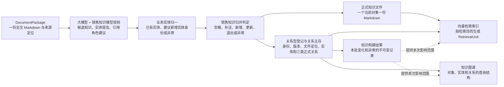

# STKB D1—D5 知识对象与业务图模型映射矩阵

> 状态：当前方案的业务图模型附件，待结合真实资料继续校验<br>
> 更新日期：2026-08-20<br>
> 适用范围：当前五个销售知识域、22 个知识内容模块（20 个计划建设、2 个可选）

## 1. 本文解决什么问题

本文不重新拆分、合并或命名知识内容模块，而是按现有职责补齐以下映射：

```text
全文 Markdown 中的证据范围
  → 文档级综合识别销售知识
  → 形成按业务对象聚合、带域、模块和类型的候选知识
  → 判断需要的 KnowledgeObject 类型和对象边界
  → 识别实体提及并归一为稳定 BusinessEntity
  → 通过实体 ID、引用角色和证据绑定 KnowledgeObject
  → 可以建立哪些业务关系
  → 归并为正式 KnowledgeObject
  → 一对象一份写入正式 Markdown 知识文件，并登记身份、版本、实体与关系
  → 记录本次知识构建结果
  → 生成向量检索索引和知识图谱
```

本矩阵用于约束销售知识识别、对象拆分、增量归并和跨域关系判定。它不是数据库表设计，也不直接规定图数据库的节点 Label、边类型、主键、索引或物理字段。

### 1.1 阅读口径

- **知识域**回答这项知识主要服务于“卖什么、卖给谁、怎么卖、具体怎么说、如何评价”中的哪一类职责。
- **知识内容模块**是域内治理分组，不是数据库、目录或实际知识内容。
- **KnowledgeObject 类型**表示业务知识单元的类型合同；它不表示每个属性、表格列、句子或清单条目都必须生成一个对象。
- **业务实体**表示具有稳定身份、可被多个知识对象共同引用的业务对象或上下文，例如产品、版本、客户特征、销售场景和阶段；它独立于知识图谱存在，不保存事实、策略、话术等知识正文。
- **实体提及**是资料中的原始名称或描述，只有完成实体归一后才能获得正式实体 ID。
- **对象—实体引用**使用 `KnowledgeObject` 身份、`BusinessEntity` 身份、引用角色和证据表达正式绑定，不靠 content 字符串匹配。
- **实体关系**表达两个 `BusinessEntity` 之间的稳定业务联系，例如产品版本属于产品；**对象关系**表达两个 `KnowledgeObject` 之间的业务语义。对象—实体引用、实体关系和对象关系都只有在存在来源依据或明确消费方时才进入当前模型。
- 每个 `KnowledgeObject` 只设置一个主归属域和主归属模块；跨域复用通过显式关系表达，不通过复制或多重主归属解决。
- 每个当前 `KnowledgeObject` 在内部文件系统中对应一份正式 Markdown 知识文件；目录按主域和主模块组织，跨域复用不复制正文。
- “产生环节”说明系统中哪类识别或归一能力负责提出该对象，不代表必须由人工逐条建立。人工只处理模型无法可靠判定且会影响发布结果的异常项。
- “适用资料”是当前最常见的来源范围，不是排他清单。

### 1.2 对象粒度口径

知识域和22个知识内容模块用于销售知识识别、分类、治理和覆盖检查，不作为22路模型调用。当本次处理要求构建销售知识时，销售知识识别在 `DocumentPackage` 可用后必然执行，由大模型参与语义识别并受销售知识模型规则约束，从全文 Markdown 中识别、提取并按业务对象边界聚合 0～N 个候选知识，同时给出主域、主模块和对象类型；该过程不是对原文的机械切分。

候选知识不是必然形成正式对象的文本切片，而是已经接近预期业务对象边界、待与当前正式知识和本批其他候选比较的临时提议。归并实现不靠统一 content 或单一向量相似度：程序先按工作区、对象类型、正式实体引用、适用范围和类型化身份缩小比较范围，向量只辅助召回可能相同的对象，大模型对小范围候选进行必要的语义身份判断，最后由程序执行硬规则校验、正式写入和异常隔离。

`KnowledgeObject` 的拆分依据是业务身份、适用范围、更新生命周期、独立复用、关系端点和明确消费方，不是文本长度或字段数量：

- 同一产品版本方案中的多个参数可以作为一个对象的类型化字段；
- 同一清单版本中的成员默认是结构化条目或实体关系，不逐项变成知识对象；
- 同一流程的步骤、条件和例外默认属于流程对象内部；
- 同一话术的措辞变化属于表达变体；
- 只有上述内容出现独立生命周期、适用范围或消费方式时，才进一步拆分。

对象内部的具体字段、条目、步骤或变体仍可绑定各自证据并参与比较，不需要为了精确回源而扩大对象数量。

## 2. 业务实体归一与对象—实体引用

业务实体先控制在能够帮助对象归一、适用范围表达、跨域连接或业务检索的范围内。资料中出现的每个名词、数值和组织名称都不需要提升为独立实体；模型输出的实体提及也不能直接成为正式实体。

### 2.1 业务实体范围

| 实体类别 | 当前主要实体 | 主要作用 | 被哪些域共同引用 |
|---|---|---|---|
| 产品上下文 | 产品、产品版本、服务、权益、竞品及竞品版本 | 统一产品身份和版本适用范围，避免不同资料中的别名造成错误归并 | D1、D3、D4、D5 |
| 客户与组织上下文 | 行业、家庭或组织、决策参与者 | 统一客户所属业务范围和多角色参与者，使客户知识、策略、话术和评价能够引用同一业务对象 | D2、D3、D4、D5 |
| 销售上下文 | 销售场景、销售阶段、渠道 | 表达知识在什么销售过程和触点下适用 | D2、D3、D4、D5 |

来源资料、资料间经明确证据建立的替代关系和全文 Markdown 中的位置属于证据引用，不属于业务实体。业务实体说明知识“关于谁或适用于什么上下文”，证据引用说明该判断“来自哪里”，两者分别保存。

销售场景和阶段的稳定身份属于 `BusinessEntity`；场景定义、阶段规则、适用策略和话术属于引用这些实体的 `KnowledgeObject`。不能让同一条记录既作为实体又作为知识对象：例如“异议处理阶段”是实体，而“异议处理阶段应先澄清客户顾虑”是方法或策略知识对象。

### 2.2 业务实体归一与正式绑定

候选知识中的实体提及先按工作区和实体类型查询关系型数据库中的已有实体，再按可靠外部业务标识、规范名称、别名、必要实体关系和来源上下文比较，形成复用已有实体、建议新增实体身份或异常结果。实体类型集合由销售知识模型约束，具体实体实例允许随资料增长。建议新增实体身份通过批内临时标识供本批候选和知识归并共同引用；只有相关知识处理结果被接受时，才与知识和正式引用一起登记。无法可靠判断时不建立正式实体或对象—实体引用。

正式绑定至少包含：

| 内容 | 作用 | 产生者 | 消费方 |
|---|---|---|---|
| KnowledgeObject 身份 | 指明哪一项知识发起引用 | 正式知识形成 | 归并、正式知识文件、向量索引和知识图谱 |
| BusinessEntity 身份 | 指明被引用的稳定业务实体 | 正式知识形成；身份依据来自业务实体归一 | 归并、过滤和关系查询 |
| 引用角色 | 描述产品、适用于版本、面向客户、发生于场景、用于阶段等 | 类型规则与引用判定 | 身份比较、适用范围、文件阅读和检索 |
| 来源证据 | 证明该实体提及和引用角色的文档位置 | 证据绑定 | 自动校验、追溯和异常处理 |

`KnowledgeObject.content` 可以包含实体名称供人阅读，但正式绑定只依赖稳定实体 ID 和引用角色。实体改名或新增别名时，不需要重写所有知识正文或创建新的知识对象。

业务实体之间可以通过有类型且有证据的实体关系连接，例如“产品版本属于产品”。实体关系与对象—实体引用分别进入关系型主存，不能因为图数据库能够表达边，就跳过正式关系判定。

### 2.3 跨模块引用的 KnowledgeObject

下列概念是跨域关系中的常见连接点，但它们首先是可独立治理的知识对象，不应为了图谱连接再复制成一套“业务实体”。

| 对象类别 | 典型 KnowledgeObject | 主要连接作用 |
|---|---|---|
| 客户知识 | 客户画像、客户需求、触发机制、异议 | 连接客户特征、购买原因、拒绝原因与适用策略 |
| 方法与表达知识 | 技巧模式、策略、合规规则、标准话术 | 连接“怎么判断和行动”与“具体怎么表达” |
| 评价知识 | 卖点、检测点、能力维度、评分规则、基准集合 | 连接事实、销售行为、评价依据和验收结果 |

## 3. D1 产品与事实域：卖什么

D1 维护产品、清单、政策流程和竞品的可核验事实，是话术、策略、问答、合规和评价引用的事实基础。D1 不负责决定应该怎样销售，也不直接存放未经核验的经验表达。

| 知识内容模块         | 业务含义                                         | 核心 KnowledgeObject 类型 | 主要引用实体             | 核心关系与映射规则                                                                     | 适用资料                       | 产生环节                        | 明确消费方                        |
| -------------- | -------------------------------------------- | --------------------- | ------------------ | ----------------------------------------------------------------------------- | -------------------------- | --------------------------- | ---------------------------- |
| D1.1 产品事实库     | 管理围绕同一产品或产品版本、共享适用范围和更新生命周期的参数、责任、限制、数值和服务权益 | 产品版本方案、产品事实卡、服务权益说明   | 产品、产品版本、服务、权益      | 对象内部可以包含多个类型化事实字段，并为字段绑定证据；按事实主题、产品/版本范围、更新生命周期和消费边界归并，事实类型和值用于内部比较，不自动决定对象数量 | 产品条款、产品说明、培训材料、服务权益说明、官方页面 | D1 事实识别、产品与版本归一、文档内聚合、对象级归并 | 精确问答、产品推荐、话术生成与校验、合规检查、D5 检测 |
| D1.2 清单事实库     | 管理需要逐项查询的集合及其成员，例如药品、疾病、机构和服务项目清单            | 清单、清单版本               | 产品版本、药品、疾病、机构、服务项目 | 产品或版本适用某清单；清单包含可查询的结构化条目；条目具有纳入、排除或条件属性，但不默认成为独立 KnowledgeObject；清单按版本和适用范围归并 | 官方清单、条款附件、Excel 明细表、服务目录   | 表格与列表识别、条目归一、清单版本识别、清单级归并   | 成员资格查询、精确过滤、理赔或服务资格说明、名单差异比较 |
| D1.3 政策流程库     | 管理投保、核保、理赔、退保、续保和服务使用等规则与步骤                  | 政策规则集、业务流程            | 产品版本、服务、办理角色、渠道    | 流程内部保存有序步骤、条件转移和例外；步骤只有在具有独立更新、复用或消费价值时才拆分为对象；政策流程回答问答并提供合规依据                 | 条款、投保须知、理赔指南、服务手册、SOP、业务通知 | 规则与流程识别、步骤结构化、条件和例外归一、流程级归并 | 流程问答、办理引导、销售说明、合规检查、流程类评价    |
| D1.4 竞品事实库（可选） | 管理有明确证据和时间范围的客观竞品差异，不存放主观贬损或无来源结论            | 竞品事实、对比维度、对比快照        | 本方产品及版本、竞品及版本      | 对比快照在同一维度和时间范围内比较双方事实；竞品事实可支持卖点或问答；所有差异必须回到证据和快照时间，不能覆盖为永久真值                  | 竞品条款、官方页面、公开说明、经核验对比材料     | 竞品事实识别、产品版本归一、同维度对齐         | 竞品问答、差异说明、卖点选择、策略参考          |

## 4. D2 客户与画像域：卖给谁

D2 管理可复用的客户特征、需求、动因、触发机制和决策角色。它不保存某次会话中的实时情绪、临时状态或 AI 扮演任务配置。

| 知识内容模块 | 业务含义 | 核心 KnowledgeObject 类型 | 主要引用实体 | 核心关系与映射规则 | 适用资料 | 产生环节 | 明确消费方 |
|---|---|---|---|---|---|---|---|
| D2.1 画像坐标轴库 | 定义可用于描述和区分客户的稳定维度、维度值及行业扩展维度 | 画像维度、维度值、行业扩展维度 | 行业、渠道 | 维度包含维度值；维度或维度值用于描述画像；只有能够支持画像构建、策略选择或评价的维度才纳入，不从每份资料随意创造新标签 | 客户分群定义、调研报告、业务标签字典、行业方法材料 | 销售知识模型维护与 D2 维度识别归一 | 画像构建、候选过滤、策略适用条件、跨企业行业模板 |
| D2.2 画像库 | 管理具有稳定特征组合的客户画像及其背景事实、可复用扮演边界 | 客户画像、画像背景事实、扮演规则 | 行业、渠道、销售场景 | 画像具有维度值、需求和触发机制；画像可被案例实例化；扮演规则只保留稳定反应边界，不包含某次训练的实时状态或 prompt 配置 | 画像研究、客户访谈、业务经验材料、典型案例 | D2 画像识别、特征归一、画像组合与归并 | AI 客户扮演、场景装配、策略检索、个性化话术 |
| D2.3 需求与决策动因库 | 管理客户要解决的问题、痛点、购买动机和稳定紧迫性判断 | 客户需求、痛点、购买动机、紧迫度规则 | 产品、销售场景、渠道 | 画像具有需求；产品或卖点满足需求；需求可能触发异议；策略适用于需求；资料仅描述现象但不能支持根因时，不直接提升为稳定动因 | 客户访谈、VOC、调研、销售案例、对话记录 | 需求与动因识别、同义归一、证据范围判定 | 需求识别、产品与卖点推荐、策略选择、客户扮演 |
| D2.4 打动点与触发机制库 | 管理客户建立信任、产生兴趣或排斥的触发条件及稳定反应模式 | 打动点、信任触发、排斥触发、反应模式 | 产品、销售场景、渠道 | 画像具有触发机制；触发机制匹配卖点；销售动作在条件下触发反应；不能把单次对话中的偶然反应直接归纳为通用规则 | 客户研究、优秀案例、对话记录、销售方法材料 | 触发机制识别、条件归一、跨证据验证 | 策略路由、AI 客户反应、话术选择、卖点优先级判断 |
| D2.5 决策链角色库（可选） | 管理家庭或组织购买中的决策者、影响者、使用者及其关注点 | 决策角色、影响关系、角色关注点 | 家庭或组织、决策参与者、渠道 | 决策链包含角色；角色影响另一角色或购买结果；角色具有关注点和决策权重；不把个人姓名作为通用决策角色知识 | 复杂销售材料、家庭决策案例、企业客户访谈、组织采购流程 | 决策角色识别、角色归一、影响关系提议 | 多角色陪练、复杂销售策略、角色化话术与评价 |

## 5. D3 方法与策略域：怎么卖

D3 管理可复用的销售方法、策略判断、场景阶段和合规规则。它不保存某个 AI 应用的 prompt、任务编排、会话状态或实时下一步结果。

| 知识内容模块 | 业务含义 | 核心 KnowledgeObject 类型 | 主要引用实体 | 核心关系与映射规则 | 适用资料 | 产生环节 | 明确消费方 |
|---|---|---|---|---|---|---|---|
| D3.1 场景与流程阶段库 | 管理销售场景的稳定骨架、阶段划分、转移条件和到位标志 | 场景骨架、销售阶段、阶段转移规则、到位标志 | 销售场景、销售阶段、渠道、产品 | 场景包含阶段；阶段按条件转移；策略适用于场景或阶段；评分规则可引用阶段到位标志；具体会话当前处于哪个阶段属于运行时状态，不进入 STKB | 销售流程、培训材料、场景设计规范、质检标准 | 场景与阶段识别、阶段归一、转移条件整理 | 陪练流程控制、策略装配、阶段检测、分阶段评价 |
| D3.2 技巧模式库 | 管理可跨表达复用的销售技巧、方法步骤和适用条件 | 技巧模式、方法步骤、适用条件 | 产品、销售场景、销售阶段、渠道 | 方法包含步骤；策略应用方法；话术执行或示范方法；能力模型和评分规则评价方法行为；只有得到跨材料支持时才提升为跨产品通用技巧 | 销售方法论、培训课件、优秀案例、标准话术 | 方法识别、目标与机制归一、适用范围判定 | 销售指导、教学、策略生成、行为评价、改进建议 |
| D3.3 策略与判断规则库 | 管理在特定条件下如何判断、采取什么动作以及下一步优先做什么 | 策略打法、判断规则、下一最佳动作、澄清问题 | 产品、销售场景、销售阶段、渠道 | 策略适用于明确上下文；策略应用一种或多种技巧；策略推荐动作；话术执行策略；案例为策略提供证据；通用技巧与产品或场景策略保持独立并建立“应用”关系 | 销售策略材料、训练方案、优秀案例、质检反馈、话术材料 | 策略识别、触发条件与动作归一、适用范围校验 | 陪练决策、销售助手策略推荐、话术选择、训练诊断 |
| D3.4 合规红线库 | 管理销售表达和行为的禁止项、风险判定模式及有依据的改写边界 | 合规规则、禁止性表述、风险判定模式、合规改写指引 | 产品版本、渠道、地区、销售场景 | 合规规则基于事实、政策或监管要求；规则约束策略和话术；评分规则引用合规依据；模型不能依据常识擅自创建高风险禁止项 | 法规、监管文件、公司合规制度、产品条款、稽核案例 | 合规规则识别、依据绑定、适用范围归一 | 生成约束、实时风险提示、评分扣分、审核与解释 |

## 6. D4 语料与案例域：具体怎么说

D4 管理经过对象化治理、可被检索和复用的表达、异议、问答、案例和物料。原始文档片段、未经核验的生成草稿和带过程噪声的对话原话不自动成为可发布话术。

| 知识内容模块 | 业务含义 | 核心 KnowledgeObject 类型 | 主要引用实体 | 核心关系与映射规则 | 适用资料 | 产生环节 | 明确消费方 |
|---|---|---|---|---|---|---|---|
| D4.1 标准话术库 | 管理具有明确回答目标、方法、适用范围和事实依据的可复用销售表达 | 标准话术、可发布表达变体 | 产品版本、销售场景、销售阶段、渠道 | 话术引用 D1 事实、表达卖点、处理异议、执行策略并受合规规则约束；同一目标、方法和适用范围下的措辞变化可作为变体，不单独建对象 | 标准话术、优秀话术、培训材料、经核验案例 | 话术识别、表达目标和方法归一、事实与合规校验 | 话术推荐、生成增强、标准表达展示、话术评价 |
| D4.2 异议库 | 管理客户拒绝或顾虑的规范含义、常见表达和可能原因，不混入完整回答 | 异议、深层原因假设、化解要素 | 产品、销售场景、渠道 | 需求可能触发异议；策略适用于异议；话术处理异议；案例提供表达证据；根本顾虑和处理方向相同的语义变体归入同一异议对象 | 异议清单、标准话术、真实对话、客户调研、销售案例 | 异议识别、根本顾虑归一、表达变体归并 | 异议检索、AI 客户扮演、应对策略和话术推荐、异议评价 |
| D4.3 Q&A与术语库 | 管理可直接检索的问题、标准回答、术语及标准解释，答案必须引用事实依据 | 问答对、术语、标准解释 | 产品版本、服务 | 问题由答案回应；答案引用 D1 事实或流程；术语具有标准解释和别名；问答不复制事实真值，D1 事实更新后需要重建或校验引用答案 | FAQ、产品手册、客服问答、培训资料、术语表 | 问题与术语识别、答案依据绑定、同义问法归并 | 精确问答、追问、概念解释、Agent 文件阅读 |
| D4.4 案例库 | 保留具有上下文、关键事件、结果和经验结论的真实或教学案例 | 案例、关键事件、结果、成败原因、经验结论 | 产品、销售场景、销售阶段、渠道、参与角色 | 案例包含有序事件；案例实例化一条销售业务链；案例可为方法、策略、话术和异议提供证据，但单个案例不能自动证明通用规则 | 成交案例、失败案例、对话记录、复盘报告、教学案例 | 案例边界识别、事件整理、参与对象与结果关联 | 案例教学、策略参考、AI 客户示例、知识抽取证据 |
| D4.5 物料与微课库 | 管理可被销售助手或训练系统直接分发的内容资产及其适用范围 | 物料资产、话术卡、微课卡片 | 产品、销售场景、销售阶段、媒体资源 | 物料引用或编排一个或多个知识对象；物料适用于明确上下文；原始媒体保留在文件存储，STKB 管理其身份、内容摘要、来源和知识引用 | 宣传册、PPT、海报、视频、课程、销售卡片 | 物料识别、内容摘要、适用范围与知识引用关联 | 销售助手推送、训练补强、课程推荐、Agent 文件阅读 |

## 7. D5 评估与基准域：卖得怎么样

D5 管理训练与销售表现如何被检测、评分、诊断和回归验证的可复用知识。某次会话的分数、模型判断和任务状态属于运行产物，不进入 D5 作为规范知识。

| 知识内容模块 | 业务含义 | 核心 KnowledgeObject 类型 | 主要引用实体 | 核心关系与映射规则 | 适用资料 | 产生环节 | 明确消费方 |
|---|---|---|---|---|---|---|---|
| D5.1 卖点与检测单元库 | 管理产品卖点及可观察、可判断的检测点和触发条件 | 卖点、检测点、触发条件 | 产品版本、销售场景、销售阶段 | D1 事实支持卖点；触发机制匹配卖点；话术表达卖点；检测点观察卖点是否被正确表达；卖点不能脱离事实来源成为营销口号 | 产品培训、质检标准、卖点清单、标准话术、客户研究 | 卖点与检测点识别、事实绑定、触发条件归一 | 卖点推荐、覆盖检测、实时评价、结果解释 |
| D5.2 能力模型库 | 管理销售能力维度、可观察行为锚点和等级标准 | 能力维度、行为锚点、等级标准 | 销售角色、销售场景、销售阶段 | 能力维度包含行为锚点；锚点指示等级；评分规则评价锚点；能力定义不保存某个学员的当前能力值 | 能力模型、培训标准、岗位要求、质检体系 | 能力维度和行为锚点识别、层级归一 | 总体评价、长期能力诊断、训练推荐、能力报告 |
| D5.3 评分规则库 | 管理如何依据证据评价行为，包括指标、规则、证据要求和宽容边界 | 评价指标、评分规则、证据要求、宽容规则 | 销售场景、销售阶段、渠道 | 评分规则评价目标对象；规则要求特定证据；规则引用卖点、阶段、合规或能力依据；规则输出的具体分数属于运行结果，不是新的知识对象 | 质检表、评分标准、评测规范、验收规则 | 指标与规则识别、证据要求结构化、冲突校验 | 实时评价、总体评价、结果解释、改进建议 |
| D5.4 基准与黄金测集库 | 管理用于回归、方案比较和验收的稳定样本、预期结果与检查清单 | 方案基准、黄金样本、回归探针、验收清单 | 应用场景、任务类型、正式知识修订点、向量/图谱构建记录、模型或检索方案版本 | 基准集合包含样本或探针；样本具有输入证据和预期行为；基准验证指定正式知识状态、检索结果或技术方案；生产运行记录只有经过筛选和确认后才能进入黄金样本 | 验收样例、历史标注、回归用例、业务评审记录、测试报告 | 基准样本整理、预期结果归一、版本绑定 | 回归测试、方案对比、客户验收、方案与技术验证 |

## 8. 当前跨域核心关系字典

以下 18 类关系来自现有 D1—D5 业务框架，用于覆盖跨域复用的主要语义。关系编码是当前讨论中的稳定引用名，不代表已经冻结物理图谱边类型。

| 编码 | 关系语义 | 来源 | 目标 | 主要用途 |
|---|---|---|---|---|
| R01 | 事实支持卖点 | D1 产品事实或竞品事实 | D5.1 卖点 | 说明卖点的客观依据 |
| R02 | 事实或流程回答问答 | D1 事实、清单或流程 | D4.3 问答 | 避免问答复制并自行维护事实真值 |
| R03 | 事实约束话术 | D1 产品事实 | D4.1 标准话术 | 校验数值、责任、限制和适用版本 |
| R04 | 事实或政策提供合规依据 | D1 事实或政策流程 | D3.4 合规规则 | 说明禁止或限制表达的业务依据 |
| R05 | 画像具有需求 | D2.2 客户画像 | D2.3 客户需求 | 连接客户特征与购买需求 |
| R06 | 画像具有触发机制 | D2.2 客户画像 | D2.4 触发机制 | 支持反应判断和策略选择 |
| R07 | 需求触发异议 | D2.3 客户需求 | D4.2 异议 | 解释异议背后的需求或顾虑 |
| R08 | 触发机制匹配卖点 | D2.4 触发机制 | D5.1 卖点 | 选择更可能打动客户的卖点 |
| R09 | 场景包含阶段 | D3.1 场景骨架 | D3.1 销售阶段 | 组织销售过程及阶段顺序 |
| R10 | 策略适用于上下文 | D3.3 策略 | 场景、阶段、画像、需求或异议 | 支持有条件的策略检索与路由 |
| R11 | 话术表达卖点 | D4.1 标准话术 | D5.1 卖点 | 连接可说内容与检测目标 |
| R12 | 话术处理异议 | D4.1 标准话术 | D4.2 异议 | 按异议检索可复用回答 |
| R13 | 话术执行策略 | D4.1 标准话术 | D3.3 策略 | 说明表达背后的销售动作 |
| R14 | 话术受合规约束 | D4.1 标准话术 | D3.4 合规规则 | 控制生成和评价风险 |
| R15 | 案例实例化业务链 | D4.4 案例 | 画像、场景、策略和结果 | 将案例与可复用知识连接，但不直接等同于通用规则 |
| R16 | 评分规则引用评价依据 | D5.3 评分规则 | 卖点、合规、基准或阶段 | 保证评分可解释、可追溯 |
| R17 | 能力包含行为锚点 | D5.2 能力维度 | 行为锚点或评分规则 | 连接能力定义与可观察行为 |
| R18 | 知识对象由来源证据支持 | 任意 KnowledgeObject | 来源资料和文档片段 | 支持追溯、版本比较和冲突判断 |

## 9. 当前方案必须覆盖的域内关系模式

现有 18 条关系主要覆盖跨域连接。为了让 22 个模块自身可以完整表达，还需要下列域内关系模式。当前先确认业务语义，关系名称、编码、方向和基数在后续关系字典评审中统一冻结。表中的“条目、步骤、事件、变体”可以是对象内部结构或对象—实体关系，不表示必须全部提升为独立 KnowledgeObject 或图节点。

| 关系模式 | 典型来源与目标 | 为什么当前需要 |
|---|---|---|
| 具有版本 | 产品→产品版本，清单→清单版本 | 支撑更新、适用范围和版本差异判断 |
| 包含条目 | 清单版本→清单条目 | 支撑逐项资格查询和清单差异比较 |
| 包含步骤／前置于 | 流程→流程步骤，步骤→后续步骤 | 支撑流程问答和办理引导 |
| 具有维度值 | 画像→画像维度值 | 支撑稳定画像表达和条件检索 |
| 包含角色／影响 | 决策链→决策角色，角色→角色 | 支撑多角色和复杂销售场景 |
| 包含方法步骤 | 技巧模式→方法步骤 | 支撑方法教学、执行和评价 |
| 策略应用技巧 | 策略→技巧模式 | 区分通用或产品级方法与具体条件策略 |
| 包含事件／事件先后 | 案例→关键事件，事件→后续事件 | 保留案例过程和成败因果线索 |
| 问答引用依据 | 问答→产品事实、流程或清单事实 | 使问答答案随事实版本可校验和重建 |
| 物料编排知识 | 物料→一个或多个 KnowledgeObject | 区分原始媒体资产与其中承载的规范知识 |
| 基准包含样本 | 基准集合→黄金样本或回归探针 | 支撑可版本化的回归与验收范围 |

## 10. 从资料到正式存储和检索结构的使用方式



三种物理形态的职责分别是：

- **正式知识文件**保存归并后的 `KnowledgeObject` 规范正文，并携带对象版本、实体 ID、引用角色、来源定位和证据入口；一个当前对象对应一份文件。
- **内部文件系统**的长期内容只保留来源 `documents/{document-package-id}/full.md` 和正式 `knowledge/{主域}/{主模块}/{knowledge-object-id}.md`；候选结果只在识别和归并运行中存在，不默认按候选数量长期落文件。
- **向量检索索引**根据检索任务生成可召回的文本单元，并使用正式实体 ID 进行产品、版本、客户或场景过滤，不独立决定知识身份、冲突和归并。
- **知识图谱**物化已经确认的知识对象、业务实体、对象—实体引用、实体关系和对象关系，用于跨域查询、关系补全和影响分析，不从图结构反向创造未经确认的实体、事实或绑定。

## 11. 当前完成度与剩余问题

| 项目 | 当前状态 | 还需要完成什么 |
|---|---|---|
| 5 个知识域和 22 个知识内容模块 | 已按现有职责完整覆盖 | 用真实资料继续检查是否存在无法归入或边界冲突的知识 |
| 核心 KnowledgeObject 类型 | 已形成当前类型范围，但已有样例存在按字段拆分过细的风险 | 先定义聚合后的对象身份、生命周期和消费边界及重点类型最小内容合同，再用样本检验 |
| 业务实体 | 已形成当前候选范围 | 明确各实体类型的准入条件、最小身份内容、别名和归一边界 |
| 对象—实体引用 | 已按模块列出主要引用实体和关系语义 | 统一引用角色、方向、适用条件和最低证据要求，确保不靠 content 字符串绑定 |
| 实体关系 | 已在模块规则和域内关系中识别产品版本属于产品等关系 | 与对象—实体引用、对象关系分开命名，明确方向和最低证据要求 |
| 跨域核心对象关系 | 已承接现有 18 条关系 | 区分对象—实体引用和对象关系，统一对象关系命名、方向、适用条件和最低证据要求 |
| 域内关系 | 已识别 11 类当前需求 | 与跨域关系合并为核心关系字典，消除同义关系 |
| 资料映射规则 | 已按模块给出来源和识别边界 | 先验证原件—随文资源—全文 Markdown 的解析与存储引用，再验证全文 Markdown 到文档级综合识别的效率和对象粒度；药享保作为样本之一，D2 另补适合资料 |
| 正式文件、向量和图谱 | 已明确各自职责 | 只对对象边界已经通过评审的重点类型定义最低结果，不把向量或图谱作为解析阶段验收项 |

## 12. 下一步建议

下一步不再把“药享保纵向验证”作为总任务。先补齐重点知识对象的最小内容与身份合同、业务实体类型和归一规则、对象—实体引用角色、核心实体/对象关系字典，以及正式知识文件、向量索引和知识图谱的最低验收结果，再用多种代表性资料检验原件、随文资源、全文 Markdown、实体、对象和关系设计；药享保仅作为其中一个样本。样本暴露的问题回写方案，逻辑闭环并通过评审后，才进入重点类型的正式知识文件、关系型登记、知识构建结果、向量索引和知识图谱技术验证。
