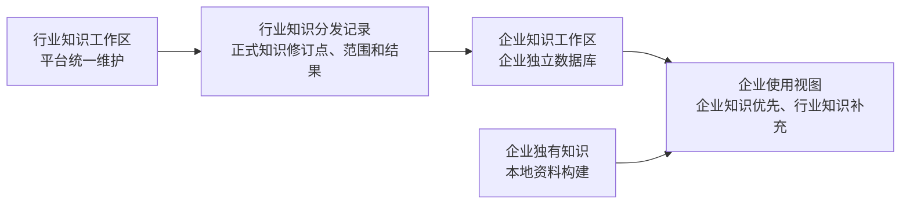

# STKB 资料接入与知识构建完整方案（讨论稿）

> 状态：当前唯一主方案，用于继续讨论完整链路、阶段产物、物理存储和验证边界；不是数据库或接口实现合同
>
> 更新日期：2026-08-20
>
> 当前责任链：资料接入 → 能力包解析（内容与随文资源提取、全文 Markdown 组装）→ 销售知识识别 → 业务实体归一 → 销售知识归并判定 → 正式知识文件与结构化登记 → 知识构建结果记录 → 向量索引与知识图谱 → 发布与检索
>
> 本文已经合并原“阶段产物、存储形态与事实源边界”独立讨论稿中的有效内容。解析过程先保存原件、提取并落存必要随文资源，再组装完整可读的全文 Markdown；全文 Markdown 是资料解析的必达业务交付物。若本次处理只要求资料解析则在此结束；若要求构建销售知识则自动进入销售知识识别。

本文是日常方案讨论的唯一连续阅读入口；《方案讨论决策台账》只追溯为什么这样决定，《D1—D5 知识对象与业务图模型映射矩阵》只作为业务模型附件查阅。

“讨论稿”表示方案中的判断可以继续被证据修正，不表示允许关键设计留空。方案确认前必须闭环主流程、阶段产物、对象身份与最小内容合同、实体和关系语义、存储职责、生命周期、失败与发布边界以及最低验收标准。可以后置的是具体产品、最终表字段、索引、容量、部署拓扑和参数调优等实现决策；技术验证用于检验已经提出的设计假设，不负责替方案补齐缺失的核心设计。

## 1. 方案结论

STKB 的最终职责是把企业或行业资料构建成可追溯、可增量更新、可供销售训练应用复用的知识资产。但不能把最终能力链等同于每次资料处理都必须同步执行到底：资料解析阶段先保存原件，提取正文、表格、图片和附件等内容，落存确需引用的随文资源，再组装一份全文 Markdown。当本次处理只要求资料解析时可以在此结束；当本次处理要求构建销售知识时，在 `DocumentPackage` 可用后必须自动进入销售知识识别，不能因为尚不知道资料属于哪个知识域或模块而跳过识别。

完整能力链为：

```text
知识工作区内的原始资料
→ 资料接入、原件落存及来源登记
→ 能力包路由
→ 正文/表格提取和必要随文资源落存
→ 全文 Markdown 组装与落存
→ DocumentPackage 可用
→ 依据 D1—D5 进行销售知识识别，大模型输出受约束候选 JSON
→ 程序解析、校验为带实体提及和引用角色建议的候选知识结构
→ 业务实体归一：读取实体规则和已有实体，形成正式实体 ID、批内临时实体标识或异常
→ 销售知识归并判定：与已有正式知识及本批次候选比较，形成知识处理结果
→ 对接受的知识处理结果，形成或更新 BusinessEntity、KnowledgeObject、对象—实体引用、实体关系和对象关系
→ 每个当前 KnowledgeObject 写成一份正式 Markdown 知识文件，并登记身份、版本、路径和校验值
→ 记录本次知识构建结果
→ 从同一正式知识修订点构建向量检索索引和知识图谱
→ 切换当前发布版本
```

这条能力链按四个阶段门槛推进。阶段是否执行取决于本次任务截止范围和前置条件，不使用“是否为某个版本必需”描述：

| 阶段 | 必须形成的结果 | 启动条件 |
| --- | --- | --- |
| 资料解析 | 可定位的原件、按需产生的随文资源，以及以 `full.md` 为主交付的 `DocumentPackage` | 资料接入后默认执行 |
| 文档级知识识别 | 0～N 个带主域、主模块、对象类型、实体提及和引用角色建议的候选知识 | 本次处理要求构建销售知识且 `DocumentPackage` 可用；满足后自动执行，是知识构建必经阶段 |
| 正式知识形成 | 内部文件系统中的正式知识文件，关系型数据库中的 `BusinessEntity`、`KnowledgeObject` 登记、对象—实体引用、实体关系、对象关系，以及本次知识构建结果 | 候选已经形成，实体归一和知识归并判定均有可接受结果；待新增实体身份尚未在此前单独落成正式实体 |
| 索引与图谱发布 | 来自同一正式知识修订点的向量检索索引和知识图谱，以及可直接读取的当前正式知识目录 | 正式知识文件和结构化登记均写入完成，且任务明确要求发布检索能力 |

其中四类关键领域产物的职责是：

| 产物 | 作用 | 是否长期存在 |
| --- | --- | --- |
| `DocumentPackage` | 组织一份来源资料的原件引用、随文资源、全文 Markdown、来源定位和质量结果；以一份全文 Markdown 为解析主交付 | 是，作为来源证据层 |
| 候选知识 | 表达“资料中可能存在一项可构建销售知识”的临时结果，可以携带尚未归一的实体提及和引用角色建议 | 不作为长期知识存在；候选内容可按运行清理，最低处理轨迹作为运行账本长期保留 |
| `KnowledgeObject` | 保存一项具有稳定业务身份的正式销售知识；规范正文以一对象一份当前 Markdown 文件保存，身份、状态、版本、路径、实体引用和关系在关系型数据库登记 | 是，作为增量比较、文件存储和治理单位 |
| 知识构建结果 | 记录本批 `DocumentPackage` 新增、更新、补证、复用、退出、忽略或异常的正式实体、知识对象和关系 | 保留不可变运行记录；没有独立业务版本或成员生命周期，不是知识事实层 |

`CandidateKnowledgeSet`、`Knowledge Resolver`、`KnowledgeObject Registry`、`Candidate Index` 和 `KnowledgeChangeSet` 不作为五个并列架构组件。候选集合、知识识别、归并比较、正式知识集合、并发去重和发布操作仍然存在，但分别属于临时产物、核心处理能力或内部实现机制。

特别说明：D1—D5 和22个知识内容模块是候选与正式对象的分类和治理框架，不是22轮模型调用；“文档片段”是从全文 Markdown 派生的证据定位，不是必须持久化的新内容层。

## 2. 目标与边界

### 2.1 本方案负责什么

- 接收 PDF、Office、Markdown、网页、图片、音频、视频等资料；
- 通过可替换能力包完成文档解析、OCR、ASR、表格和多模态内容还原；
- 先保存原件并登记物理存储引用，再提取正文、表格和必要随文资源，最后组装全文 Markdown，形成可阅读、可定位、可复核的 `DocumentPackage`；
- 当本次处理要求构建销售知识时，在 `DocumentPackage` 可用后依据当前 D1—D5、22 个知识内容模块自动执行文档级、多标签销售知识识别；
- 按预期业务对象粒度聚合多项、多域候选知识，不把句子、字段或表格单元格默认提升为对象；
- 先把候选中的实体提及归一为稳定业务实体身份，再将候选与当前工作区正式知识及本批次其他候选比较；
- 自动完成明确的忽略、补证、新增、更新和异常隔离；
- 形成或更新正式 `KnowledgeObject`；
- 记录本次知识构建结果，用于追溯本批资料造成的正式知识变化；
- 把正式知识正文写入内部文件系统，并从同一正式知识修订点构建向量检索索引和知识图谱；
- 支持行业知识向企业工作区的单向分发和企业知识扩展。

### 2.2 本方案不冻结的实现决策

- 不自行从零实现所有 PDF、OCR、ASR 和 Office 底层能力；
- 不冻结 `KnowledgeObject` 的最终数据库表、字段名或 JSON Schema，但必须定义重点类型的逻辑内容合同和身份规则；
- 不把 D1—D5 的 22 个模块逐个展开为研发字段，但必须说明各模块的对象类型、边界、来源和消费方；
- 不把五个知识域或22个模块设计成模型逐项循环调用；
- 不要求为全文 Markdown 预先生成并长期保存一套“抽取窗口”；
- 不设计 AI 助手或 AI 陪练的提示词、模型参数、任务状态和实时会话状态；
- 不确定生产数据库、独立向量库、原生图数据库、embedding 模型或编排框架的最终选型；
- 不以人工逐条审核作为默认知识发布路径；
- 不在方案逻辑闭环前进入全面开发、性能压测或生产数据库建模。

以上边界只排除实现层冻结，不排除方案层设计。凡是会影响业务对象身份、数据去向、事实主存、关系解释、发布安全或消费结果的规则，都必须在方案中说明。

## 3. 方案输入

### 3.1 知识工作区

知识工作区是资料、正式知识和检索结构的逻辑隔离与维护边界。资料接入时必须已经属于一个工作区，后续所有产物继承该归属。

当前至少包含：

| 工作区 | 维护方 | 保存内容 | 使用方式 |
| --- | --- | --- | --- |
| 行业知识工作区 | STKB 平台或行业知识维护方 | 可跨企业复用的行业事实、方法、策略、案例和评估知识 | 单向分发给企业工作区 |
| 企业知识工作区 | 对应企业 | 企业资料构建出的产品、客户、策略、话术、案例等独有知识 | 企业内部使用，并可扩展或覆盖行业知识 |

当前 SaaS 关系型数据采用一个客户一个独立数据库。正式 `BusinessEntity`、`KnowledgeObject` 的身份与版本登记、对象—实体引用、实体关系和对象关系进入关系型主存；每个当前 `KnowledgeObject` 的规范正文以一份 Markdown 文件进入 Agent 与处理程序可以直接访问的内部文件系统。本次知识构建结果和索引构建结果进入关系型处理账本；原始文件、图片、音视频、复杂图表和嵌入附件等二进制内容进入工作区隔离的对象存储空间；内部文件系统默认只长期保存每份资料的全文 Markdown 和每个当前知识对象的正式 Markdown，不把候选、模型原始输出、运行报告或历史快照展开成默认文件树。向量检索索引和知识图谱分别使用 collection/namespace 或独立图数据库等物理空间。关系型数据库统一保存各类内容的业务身份、版本、稳定文件路径、对象存储引用和索引位置；工作区不等同于这些物理名称，技术栈变化不能改变知识归属。

### 3.2 STKB 销售知识模型

当前方案直接采用已经确认的 D1—D5 和 22 个知识内容模块作为销售知识识别与归并依据：

| 销售知识域 | 回答的问题 | 当前模块范围 | 典型知识 |
| --- | --- | --- | --- |
| D1 产品与事实 | 卖什么 | 产品事实、清单事实、政策流程、竞品事实（可选） | 产品责任、价格、权益、流程、清单条目 |
| D2 客户与画像 | 卖给谁 | 画像坐标轴、画像、需求与动因、打动点、决策链角色（可选） | 客户特征、需求、触发机制、决策角色 |
| D3 方法与策略 | 怎么卖 | 场景与流程阶段、技巧模式、策略与判断规则、合规红线 | 销售方法、场景策略、动作规则、约束 |
| D4 语料与案例 | 具体怎么说 | 标准话术、异议、Q&A 与术语、案例、物料与微课 | 异议、话术、问答、真实案例、训练内容 |
| D5 评估与基准 | 卖得怎么样 | 卖点与检测单元、能力模型、评分规则、基准与黄金测集 | 检测点、行为锚点、评分依据、黄金样例 |

这些知识域不是上传资料的排他目录。一份资料可以命中多个域；同一段证据也可以同时支撑多个知识对象。

### 3.3 外部能力与本地业务设计的边界

成熟解析、RAG 和知识库项目可以支撑格式解析、文档元素、来源锚点、索引、版本和工作区等工程机制，但不能替代 STKB 对销售知识对象、业务身份和归并规则的定义。

因此：

- 能力包负责尽可能还原“资料写了什么、在哪里”；
- STKB 销售知识模型负责判断“哪些内容属于销售训练知识”；
- 业务实体归一负责判断“资料里提到的产品、版本、客户或场景具体是谁”；
- 知识归并负责判断“是否是同一项知识、应该如何更新”；
- 正式知识文件、向量索引和知识图谱让不同访问方式使用同一批知识；其中正式知识文件保存知识正文，后两者是可重建检索结构。

## 4. 总体架构

```mermaid
flowchart LR
    W["知识工作区<br/>行业或企业"]
    K["STKB 销售知识模型<br/>域、模块、知识类型、实体类型、身份与引用规则"]
    S["原始资料<br/>PDF、Office、图片、音视频等"]
    I["资料接入与原件落存<br/>独立文档包身份、存储引用、任务"]
    R["能力包路由与解析<br/>正文/表格提取、OCR、ASR、多模态"]
    X["必要随文资源落存<br/>图片、复杂图表、附件、必要媒体"]
    D["全文 Markdown 组装与落存<br/>引用随文资源、保留来源定位"]
    DP["DocumentPackage 可用<br/>包身份、物理定位、质量问题"]
    T["仅要求资料解析时完成<br/>DocumentPackage 作为交付"]
    E["文档级销售知识识别<br/>大模型受约束 JSON，程序解析与校验"]
    C["程序候选结构<br/>类型化内容、实体提及、引用角色、证据"]
    N["业务实体归一<br/>正式实体 ID、批内临时标识或异常"]
    M["销售知识归并判定<br/>忽略、补证、新增、更新、退出或异常"]
    O["结构化登记与关系主存<br/>对象身份、实体、引用、关系、版本、文件路径"]
    B["知识构建结果<br/>本次新增、更新、补证、复用、退出、忽略、异常"]
    F["正式知识文件库<br/>一个当前对象一份 Markdown"]
    V["向量检索索引<br/>检索单元、embedding、过滤信息"]
    G["知识图谱<br/>对象、实体、关系、证据引用"]
    P["发布切换<br/>文件、向量和图谱指向同一知识修订点"]

    W --> S --> I --> R --> X --> D --> DP
    K --> E
    K -. "实体类型、身份与引用规则" .-> N
    DP --> T
    DP -- "要求构建销售知识时自动进入" --> E --> C --> N --> M
    M --> O
    M --> F
    O --> B
    F --> P
    O --> V --> P
    O --> G --> P
    O -. "读取已有实体登记" .-> N
    B -. "提供本次影响范围" .-> V
    B -. "提供本次影响范围" .-> G
    O -. "比较基准" .-> M
    C -. "本批其他候选" .-> M
```



全链路机制、职责和检索闭环继续以本方案正文为准。旧的生成型流程图已清理；后续应由 Vue 验证工作台直接展示真实运行过程，不再维护与代码分离的静态 HTML 数据流图。

## 5. 各阶段职责、输入与输出

“负责能力”说明该阶段做什么，“主要执行方”说明由哪类机制实际完成；主要执行方可以组合出现，不代表已经选定具体产品。

| 阶段 | 负责能力 | 主要执行方 | 主要输入 | 主要输出 | 关键边界 |
| --- | --- | --- | --- | --- | --- |
| 资料接入 | 文件接收、基础校验、原件落存和来源登记 | 程序代码 + 对象存储 | 工作区上下文、原始文件和可选的明确替代声明 | 已落存原件、独立来源记录、原件存储引用、处理任务 | 每次接入默认形成新的 `DocumentPackage`，不按文件名或相似内容自动生成资料版本链；数据库不保存原件二进制副本 |
| 能力包路由 | 根据资料类型和能力可用性选择处理能力并编排执行 | 程序代码 | 文件类型、轻量预检、能力可用性 | 能力组合和执行计划 | 不绑定单一解析项目，也不判断知识域和模块 |
| 内容与资源提取 | 提取正文、表格、来源位置和必要随文资源 | 外部文档解析、OCR、ASR、表格或多模态能力 + 适配器程序代码 + 对象存储 | 原件存储引用、执行计划 | 正文、表格结构、来源位置，以及已落存并登记的必要随文资源 | 图片、音视频、复杂图表和附件进入对象存储；普通正文、简单表格和转写文本直接供 Markdown 组装，不建立解析元素主存 |
| 全文 Markdown 组装 | 按原资料顺序组装、校验并落存全文 Markdown | 程序代码 + 内部文件系统 | 已提取内容、随文资源的逻辑引用、来源位置 | 已落存 `full.md`、`DocumentPackage` 记录、内部文件路径和质量结果 | 资料解析的必达业务结果；程序和 Agent 可直接读取；资源逻辑引用必须可解析，不要求同时生成候选、向量或图谱 |
| 销售知识识别 | 在销售知识模型规则约束下进行语义识别、提取、聚合和分类 | 大模型 + 上下文组装与结果校验程序代码 | 全文 Markdown、来源定位、知识域、知识内容模块、对象类型、允许的业务实体类型和引用角色规则 | 大模型按受约束 JSON 输出 0～N 个候选；程序校验后形成运行中的候选知识结构，包含内容、分类、实体提及、引用角色建议和证据 | 构建销售知识时必经；原始模型 JSON 不是正式对象或长期知识，实体提及不是正式实体；未识别到销售知识时输出零个候选知识 |
| 业务实体归一 | 确认候选中的实体提及具体指向谁，并校验建议实体类型和引用角色 | 程序代码为主；名称、别名和上下文仍有歧义时由大模型辅助 | 程序校验后的候选知识、销售知识模型中的实体类型与身份规则、关系型数据库中的已有实体登记、来源上下文和本批其他归一结果 | 每个提及的归一结果：已有实体 ID、批内临时实体标识及待新增身份提议，或异常；以及带引用角色和证据的候选—实体绑定提议 | 实体类型集合由模型约束，实体实例集合允许随资料增长；本阶段不因一个临时候选就立即创建正式实体或正式引用 |
| 销售知识归并判定 | 基于实体归一结果，召回可能相同的正式知识，按对象类型身份规则比较并选择知识处理动作 | 程序代码 + 大模型；向量检索只辅助召回可能相同的知识 | 带实体归一结果的候选知识、正式知识、本批次其他候选、对象类型身份规则和适用范围 | 每项候选的目标 `KnowledgeObject` 或新增对象提议，以及忽略、补证、新增、更新、退出、异常等知识处理结果；对象关系建议 | 只回答“是不是同一项知识、候选应当去哪里”；必需实体仍异常时停止该候选的归并，不由模块、文本相似度、大模型单次输出或向量相似度单独决定 |
| 正式知识形成 | 校验知识处理结果，把每个当前知识对象写成一份正式 Markdown 知识文件，并登记实体、对象身份、版本、文件路径、校验值、对象—实体引用、实体关系、对象关系和证据绑定 | 程序代码 + 内部文件系统 + 关系型数据库 | 已接受的知识处理结果、相应实体归一结果和关系结果 | 新建或更新的正式知识文件、`BusinessEntity`、`KnowledgeObject` 登记、对象—实体引用、实体关系和对象关系，以及正式知识修订点 | 只有引用它的知识处理结果被接受，待新增实体身份才与知识及引用一起正式登记；忽略或异常候选不留下孤立实体；大模型不能直接写正式文件或数据库 |
| 知识构建结果记录 | 汇总本批资料造成的正式知识变化和未采用结果 | 程序代码 + 关系型处理账本 | 构建运行、输入文档包、正式写入结果和异常 | 本次新增、更新、补证、复用、退出、忽略、异常的实体、对象和关系引用及摘要 | 结果不可变但不拥有业务版本、成员状态、发布状态或正式知识正文；不默认另存长期报告文件 |
| 向量索引与知识图谱构建 | 从同一正式知识修订点读取知识文件和结构化登记，生成向量检索索引与知识图谱 | 程序代码 + embedding 模型、向量库和图数据库 | 正式知识修订点、本次影响范围和目标范围 | 向量索引、知识图谱及各自构建记录 | 知识构建结果只提示影响范围；向量和图谱可重建，不反向修改正式知识 |
| 发布切换 | 校验正式知识目录、向量索引和知识图谱的一致性并切换当前生效版本 | 程序代码 + 关系型数据库及各存储的版本指针机制 | 同一正式知识修订点的文件清单、向量与图谱构建结果 | 当前生效的正式知识修订点及检索入口绑定 | 失败时保留上一可用版本，不混用新旧结果 |

大模型参与销售知识识别、实体歧义消解和需要语义判断的知识归并；程序代码负责流程编排、确定性匹配、候选召回、格式校验、状态管理、规则执行、正式写入和发布控制；外部技术栈提供解析、模型推理和物理存储能力。人工不是任何阶段的默认执行方，只处理无法可靠自动判断且会影响发布的异常。业务实体归一和销售知识归并判定可以由同一流程服务连续执行，但必须保留各自独立的输入、输出、规则和异常原因，不因此增加两个必须独立部署的架构组件。

## 6. 阶段数据、物理存储与核心逻辑对象

本节同时回答“每一步产生什么”“内容本体存在哪里”“关系型数据库保存什么定位信息”和“哪些数据具有业务真值”。当前冻结的是存储职责，不是数据库产品、表名、索引或部署拓扑。

### 6.1 权威来源与物理存储合同

#### 6.1.1 正式知识不是单一数据库大对象

| 权威部分 | 回答的问题 | 权威内容 | 不能承担的职责 |
| --- | --- | --- | --- |
| 来源证据 | 原资料写了什么、位于哪里 | 原始文件、随文资源、全文 Markdown、来源定位和解析质量 | 不自动证明内容真实、有效或可发布 |
| 正式知识正文 | STKB 当前认可的一项销售知识具体写了什么 | 内部文件系统中一对象一份的当前 Markdown 知识文件，以及文件引用的来源证据 | 不独立决定对象身份、状态、实体身份和正式关系 |
| 正式登记与关系 | 这项知识是谁、当前哪个版本生效、引用哪些实体、与其他对象有什么关系 | 关系型数据库中的 `KnowledgeObject` 身份与版本登记、`BusinessEntity`、对象—实体引用、实体关系、对象关系、文件路径和内容校验值 | 不复制保存一份可编辑的 Markdown 正文，不把路径字符串当知识身份 |
| 派生检索结构 | 如何按语义或关系高效找到正式知识 | 向量检索索引和知识图谱中的对象版本回指、过滤信息、节点和边 | 不决定知识正文、对象身份和归并结果，可以从正式知识重建 |

因此，不再把“文件、向量、图谱”描述成地位相同的三种投影。一个正式 `KnowledgeObject` 的完整存储形态是“正式 Markdown 知识文件 + 关系型登记与关系记录”；向量索引和知识图谱是围绕这批正式知识构建的检索结构。文件内容和数据库登记必须以同一正式知识修订点一致生效，任何一边单独存在都不构成一个可发布的正式知识对象。

#### 6.1.2 文件内容本体、内部文件系统与对象存储

不能因为内容都表现为“文件”，就把原件、全文 Markdown 和发布知识文件统一放入同一种物理空间。本方案按访问方式拆分：

1. **内部文件系统**默认只长期保存需要被处理程序或 Agent 直接列举、查找、文本搜索和按需读取的两类 Markdown：每份资料的 `full.md`，以及每个当前 `KnowledgeObject` 对应的正式知识文件；候选知识、模型原始输出、运行报告和历史快照不默认展开为长期文件树；单机环境可以使用受控本地目录，多实例环境使用各实例能够共同访问的内部共享文件系统；
2. **对象存储**保存所有格式的原始文件，以及解析提取的图片、音视频、复杂图表、嵌入附件和其他大型二进制资源；对象通过稳定 object key 精确读取，不作为 Agent 直接遍历和全文搜索的目录；
3. **关系型数据库**保存 `DocumentPackage` 身份和可选的资料替代关系，以及 `BusinessEntity`、`KnowledgeObject` 的身份、修订、状态、正式知识文件路径与校验值、对象—实体引用、实体关系、对象关系、证据绑定、知识构建结果、正式知识修订点和索引构建记录；同一份原件的重新解析只记录为新处理运行，不生成资料版本；数据库不复制维护一份可编辑的 Markdown 正文或原件二进制。

内部文件系统中的 Markdown 可以包含稳定逻辑资源引用，但不直接保存 OSS/S3 的临时签名 URL。逻辑资源引用先定位 `DocumentResource` 或来源文件记录，再由 STKB 在读取时校验工作区和权限，并生成短期地址或返回文件流。

以下名称是逻辑属性，不是已经冻结的字段名：

| 逻辑属性 | 含义 | 产生者 | 用途与消费者 | 适用内容 |
| --- | --- | --- | --- | --- |
| 存储类型 | 内容位于内部文件系统还是对象存储 | 存储适配器 | 选择目录读取或对象读取方式 | 所有文件型内容 |
| 存储命名空间 | 内部文件系统根目录的逻辑标识，或对象存储 bucket/container 标识 | 存储适配器 | 确定物理空间和工作区隔离 | 所有文件型内容 |
| 存储键 | 内部文件系统根目录下的相对路径，或对象存储 object key | 存储适配器 | 稳定定位内容本体，不依赖机器绝对路径或临时 URL | 所有文件型内容 |
| 逻辑资源引用 | 指向来源文件或 `DocumentResource` 身份的稳定引用，不等同于 OSS/S3 URL | 资料接入、资源登记或证据绑定 | Markdown 阅读、Agent 回源、权限校验和下载 | 原件、图片、音视频、复杂图表和附件被 Markdown 或知识证据引用时 |
| 内容校验值 | 对实际文件内容计算的摘要 | 接入、解析或正式知识写入流程 | 完整性检查、重复处理判断和版本追溯 | 需要持久化的文件型内容 |
| 媒体类型与大小 | 文件内容类型和字节大小 | 存储适配器 | 正确读取、下载和基础质量检查 | 所有文件型内容 |

数据库和 Markdown 都不保存临时签名 URL 作为长期地址。内部文本按“内部文件系统命名空间 + 相对路径”直接读取；对象内容按“对象存储命名空间 + object key”由 STKB 读取；对外访问地址根据逻辑资源引用临时生成，避免签名过期或存储域名迁移后改写知识文件。

#### 6.1.3 各阶段物理落点

| 数据结果 | 内容本体物理空间 | 关系型数据库保存的记录或定位 | 权威边界 |
| --- | --- | --- | --- |
| 原始文件 | 对象存储中的 PDF、Office、Markdown、网页归档、图片、音视频等原件；本地验证可以使用受控来源目录 | `DocumentPackage` 身份、工作区、对象存储键和校验值；有明确证据时可另登记与其他资料的替代关系 | 原件不可被解析结果覆盖；同名或相似资料不自动并成版本；不作为 Agent 默认检索目录 |
| 随文资源 | 对象存储中的图片、复杂图表、嵌入附件或必要媒体 | 所属文档包、资源角色、来源位置、对象存储键、逻辑资源引用和校验值 | 只保存被 Markdown 或证据消费的资源；不把临时 URL 写入 Markdown |
| 全文 Markdown | 内部文件系统中的 `documents/{document-package-id}/full.md` | 文档包身份、内部文件相对路径、校验值、状态和质量摘要 | 资料解析主交付；程序和 Agent 可直接读取，数据库不复制正文 |
| 来源定位与质量问题 | 简单锚点随 `full.md`；结构化信息存关系型数据库 | 文档包身份、锚点、原页/原表格/时间段、问题类型和状态 | 不另存一套片段正文 |
| 候选知识结果 | 识别和归并运行中的内存或受控临时空间，不默认作为长期文件保存 | 关系型处理账本只保留构建运行、输入文档包、处理动作、目标对象、必要原因和结果计数 | 过程数据；不按候选数量生成文件，不形成独立候选知识库；只在明确需要调试或审计时才可将模型原始输出作为有保留期的技术附件 |
| 归并处理结果 | 结构化内容直接存关系型数据库 | 候选运行引用、处理动作、原因、目标对象版本和证据引用 | 驱动正式知识变化的处理账本 |
| 正式知识文件 | 内部文件系统中一对象一份的当前 Markdown 文件；正文内可使用稳定逻辑资源引用 | 对象身份、当前版本、主域、主模块、对象类型、文件相对路径、内容校验值、状态和正式知识修订点 | 保存正式知识规范正文；不是从数据库重新编译出的阅读副本，也不是多个对象拼成的主题文章 |
| 业务实体、对象登记和正式关系 | `BusinessEntity`、`KnowledgeObject` 身份与版本登记、对象—实体引用、实体关系和对象关系直接存关系型数据库 | 实体身份与状态、对象身份与版本、正式知识文件定位、实体引用角色、实体/对象关系、适用范围和证据 | 与正式知识文件共同组成正式知识状态；数据库不重复保存 Markdown 正文 |
| 知识构建结果 | 结构化摘要直接存关系型处理账本，不默认另存长期 JSON/Markdown 报告 | 构建运行、输入文档包、正式知识修订点、新增/更新/补证/复用/退出/忽略/异常的实体、对象和关系引用 | 一次批处理的不可变结果；没有独立业务版本和成员生命周期，不拥有正式知识 |
| 向量检索索引 | pgvector 或独立向量库中的检索文本、embedding 和过滤元数据 | 索引构建、正式知识修订点、目标 collection/namespace、embedding 合同版本和状态 | 向量回指知识对象版本，可重建，不裁决归并 |
| 知识图谱 | 原生图数据库；验证阶段可先用关系图表 | 图谱构建、正式知识修订点、目标 graph/namespace、图模型版本和状态 | 节点和边回指正式对象、实体和关系，可重建 |

一个不冻结最终目录名的物理空间示例如下。两种空间通过关系型记录和逻辑资源引用关联，不要求 Agent 直接浏览对象存储：

```text
内部文件系统根目录：
workspaces/{workspace-id}/
  documents/{document-package-id}/full.md
  knowledge/
    D1-产品与事实/{module-id}/{knowledge-object-id}.md
    D2-客户与画像/{module-id}/{knowledge-object-id}.md
    D3-方法与策略/{module-id}/{knowledge-object-id}.md
    D4-语料与案例/{module-id}/{knowledge-object-id}.md
    D5-评估与基准/{module-id}/{knowledge-object-id}.md

对象存储：
workspaces/{workspace-id}/
  sources/{document-package-id}/original.ext
  document-resources/{document-package-id}/{resource-id}/...
```

`knowledge/` 直接是当前正式知识正文目录，不再默认增加 `current/`、`history/`、运行结果或报告子树。每个生效 `KnowledgeObject` 在其主域和主模块目录下只有一份当前 Markdown；跨域关系通过对象 ID 引用，不复制出第二份知识文件。关系型登记保存当前对象 ID、修订、相对路径和校验值，可在发布校验时生成短期清单，但不要求在知识目录中长期维护第二份 `manifest.json`。旧正文是否由文件快照、备份或审计存储保留属于后续实现选择，不展开为 Agent 默认检索的文件树。

#### 6.1.4 一批资料会产生多少文件

设一批输入包含 `M` 份来源资料，识别产生 `N` 个候选知识，归并后形成 `A` 个新增知识对象、`U` 个已有对象更新或补证，另有 `R` 个仅复用且正文不变的对象，以及 `I` 个忽略或异常结果。则：

| 物理空间 | 本批形成或改动的数量 | 说明 |
| --- | --- | --- |
| 对象存储 | `M` 个原件 + `Q` 个必要随文资源 | `Q` 只计算实际提取并被全文或证据引用的图片、音视频、复杂图表和附件；它们不是销售知识对象 |
| 内部文件系统：全文 Markdown | `M` 份 `full.md` | 一份来源资料对应一份 `DocumentPackage` 和一份全文 Markdown |
| 候选知识运行数据 | 不默认新增长期文件 | `0～N` 个候选在内存或受控临时空间中流转；关系型处理账本保留处理动作、目标对象、必要原因和计数，不为每个候选单独创建文件 |
| 内部文件系统：正式知识文件 | 新建 `A` 份，改写 `U` 份，正文未变的 `R` 份不改写 | 一个当前 `KnowledgeObject` 对应一份当前 Markdown；文件数量取决于归并后的对象数量，不等于候选数量，也不按五域或22模块固定生成 |
| 关系型数据库 | 按 `A/U/R/I` 记录对象、实体、引用、关系和处理动作 | 这是结构化记录数量，不等同于文件数量 |
| 向量库 | `C` 个检索单元及向量 | `C` 可大于对象数，由正式知识文件的检索切分规则决定；它不是新增知识对象数量 |
| 图数据库 | 本批受影响的对象节点、实体节点和关系边 | 数量取决于对象引用的实体和正式关系，不按文件数量机械一一生成 |

因此，本批内部文件系统的**新增长期文件数**为 `M + A`：`M` 份 `full.md` 和 `A` 份新增正式知识文件；同时改写 `U` 份已有正式知识文件。候选知识、模型原始输出、可选报告和历史快照不计入默认长期文件数。

例如，10份资料识别出80个候选知识，如果这80项主要来自跨资料重复、补充和与已有知识的比较，归并后得到18个新增对象、7个已有对象更新是可能的。此时长期文件只新增10份 `full.md` 和18份正式知识 Markdown，并改写7份已有知识文件；80项候选不各自生成文件。但如果80项候选是因为单份资料被按句子、字段或表格单元格机械拆分，则说明销售知识识别粒度失败，不应由归并阶段作为批量压缩器补救。

### 6.2 `DocumentPackage`

一次接入的一份原始资料对应一个独立 `DocumentPackage`。它回答“本次接入的原资料里有什么、在哪里、解析质量如何”。它跨关系型数据库、内部文件系统和对象存储组织来源证据，不等同于某个目录：原件和二进制随文资源位于对象存储，全文 Markdown 位于内部文件系统，数据库保存文档包身份和两类稳定引用。新上传的同名或相似资料默认形成新 `DocumentPackage`，不自动作为旧资料的新版本；只有明确证据或上传声明时才登记资料间的替代关系。解析主交付不是一组切片，而是一份可以从头到尾阅读的全文 Markdown。

| 逻辑内容 | 含义 | 产生者 | 消费者 | 适用资料 |
| --- | --- | --- | --- | --- |
| 文档包身份与原件引用 | 指向本次接入并用于解析的原始文件及其物理存储引用；内容哈希可用于判断完全重复，不用于自动创建资料版本链 | 资料接入 | 重放、追溯和重复检查 | 所有资料 |
| 随文资源及逻辑引用 | 从原件提取或为保真阅读生成、被全文 Markdown 或证据引用的图片、复杂图表、嵌入附件和必要媒体；Markdown 保存资源身份的逻辑引用，不保存对象存储临时地址 | 解析能力包与资源登记 | Markdown 组装、完整阅读、视觉复核和证据核验 | 实际存在相应资源时 |
| 全文 Markdown | 在所需随文资源已经落存后，组装整份资料的标题层级、正文顺序、表格、资源引用、对话和多模态描述 | 解析能力包 | 人、Agent，以及要求构建销售知识时执行的销售知识识别 | 所有资料 |
| 来源定位 | 页码、标题路径、表格位置、时间段等位置；优先随 Markdown 或结构化锚点表达 | 解析适配器 | 证据绑定和回源 | 需要定位的资料 |
| 质量问题 | 缺页、OCR 疑点、表格错位、说话人不确定等 | 能力包与质量判断 | 降级、重试、知识使用限制 | 出现问题时产生 |

解析阶段的物理持久化顺序为：原件内容写入对象存储并在关系型数据库登记 `DocumentPackage` 身份、对象键和校验值；必要随文资源写入对象存储并逐项登记所属文档包、来源位置、对象键和逻辑资源引用；随后生成 `full.md`，将资源逻辑引用写入 Markdown，把 Markdown 落存到内部文件系统，并在文档包记录中保存内部相对路径、校验值、状态和质量摘要。对同一份原件重新解析只新增处理运行，不改变资料身份也不创建资料版本。数据库和 Markdown 都不保存临时签名 URL，也不复制维护另一份可编辑正文。

需要离线交付时，可以从对象存储取回所引用资源，与数据库记录和内部文件系统中的 `full.md` 一起导出为 `manifest.json + assets/ + full.md` 目录。该目录是便携表达，不是生产环境中与数据库并列维护的第二套事实源。

`DocumentPackage` 不是正式知识、知识构建结果、向量 chunk 或图谱节点。文档片段可以按标题、页码、表格或时间标记从全文 Markdown 派生，不要求预先生成 `fragments.jsonl`、片段数据库表或“抽取窗口”对象。

### 6.3 候选知识

候选知识是大模型在销售知识模型规则约束下，对全文 Markdown 进行识别、提取并按业务对象边界聚合后形成的临时结果，不叫“候选 KnowledgeObject”，也不构成长期知识层。一次识别可以输出 0～N 个候选知识；它不是对全文 Markdown 的机械切分：同一处证据可以支撑多个候选，多处证据也可以聚合为一个候选，普通非销售内容不形成候选。

| 逻辑内容 | 含义 | 产生者 | 消费者 | 适用资料 |
| --- | --- | --- | --- | --- |
| 临时引用 | 在本次任务和批次内定位候选知识 | 识别流程 | 归并判定和处理结果回链 | 所有候选知识 |
| 主域、主模块和对象类型 | 候选知识主要属于哪类销售知识 | 销售知识识别 | 缩小比较范围、选择类型规则 | 所有候选知识 |
| 候选知识内容 | 按对象类型聚合的字段、步骤、条目、策略、异议或话术含义，是候选知识的内容主体 | 类型化识别与文档内聚合 | 与正式知识比较 | 所有候选知识 |
| 实体提及 | 原文中出现的产品、版本、客户特征、场景、阶段等名称或描述，以及建议实体类型；仍然是待归一文本 | 大模型语义识别 | 实体归一 | 候选知识涉及可复用业务对象或上下文时 |
| 引用角色建议 | 候选知识可能以“描述产品、适用于版本、面向客户、发生于场景”等角色引用实体 | 大模型语义识别与类型规则 | 对象—实体引用判定 | 证据能够说明引用角色时 |
| 适用范围 | 证据明确支持的产品、版本、客户或场景范围，可以先由实体提及表达 | 识别与证据绑定 | 实体归一、身份判断和防止误用 | 有明确范围时产生 |
| 证据引用 | 回指 `DocumentPackage` 的具体位置 | 证据绑定 | 自动判定、追溯和异常处理 | 所有候选知识必需 |
| 待判定实体/对象关系 | 例如产品版本属于产品、策略应用技巧、话术处理异议，作为候选知识的标注而不是正式关系 | 关系识别 | 实体关系和对象关系判定 | 证据确实表达关系时产生 |

候选不默认增加人工审核状态和通用置信度。模型分数可以作为内部信号，但不能单独决定发布。

#### 6.3.1 大模型输出与程序候选结构

销售知识识别推荐使用受 JSON Schema 或同等结构约束的模型输出。模型接口返回的是 JSON 传输内容，程序必须先完成解析、枚举值校验、必填内容校验和来源定位校验，再形成运行中的候选知识结构；不能把原始 JSON 串直接当成正式候选、正式知识或数据库记录。

下例只说明逻辑形态，字段名和最终序列化 Schema 留到实现设计确定：

```json
{
  "candidateId": "C1",
  "objectType": "CUSTOMER_OBJECTION",
  "domain": "D4",
  "module": "D4.2",
  "content": {
    "rootConcern": "客户已有医保，认为没有必要再购买该产品"
  },
  "entityMentions": [
    {
      "mentionId": "M1",
      "text": "药享保",
      "proposedType": "PRODUCT",
      "referenceRole": "ABOUT_PRODUCT",
      "sourceRef": "DP-A#page-12-paragraph-3"
    }
  ],
  "evidence": ["DP-A#page-12-paragraph-3"]
}
```

其中 `candidateId` 和 `mentionId` 只在本次构建运行内回链；`objectType/domain/module` 由大模型提出、程序按当前销售知识模型校验；`content` 是按知识对象类型聚合的候选内容；`entityMentions` 由大模型识别，供实体归一使用；`sourceRef/evidence` 由识别结果与 `DocumentPackage` 来源定位共同产生，供校验、回源、归并和异常处理使用。没有明确消费者的模型推理字段不进入候选合同。

候选知识的默认物理形态是程序内存中的结构化对象或受控临时任务数据，归并完成后释放，不在内部文件系统中默认长期保存 `candidate-result.json`，也不为每个候选另建文件、候选库或候选索引。关系型处理账本保存运行身份、输入文档包、执行状态、模型/规则版本、结果计数，以及驱动正式变化的处理动作、目标对象、必要原因和证据引用。只有当调试、问题复现或审计明确需要原始模型输出时，才可将原始 JSON 作为设置保留期的技术附件存入对象存储；这仍不是正式知识或默认文件层。

### 6.4 `BusinessEntity` 与对象—实体引用

`BusinessEntity` 中文称“业务实体”，是独立于知识图谱存在、可以被多项知识共同引用的稳定业务对象或上下文，例如产品、产品版本、客户特征、销售场景、销售阶段和渠道。业务实体不保存保障事实、销售策略、异议或话术正文；这些知识内容由 `KnowledgeObject` 管理。资料中出现的任意名词也不会自动成为业务实体。

业务实体的最小逻辑内容如下。这些是方案合同，不是已经冻结的数据库字段名：

| 逻辑内容 | 含义 | 产生者 | 消费者 | 适用情况 |
| --- | --- | --- | --- | --- |
| 稳定实体身份 | 在工作区内跨资料、知识版本和存储形态保持不变的实体标识 | 首次正式实体形成 | KnowledgeObject 引用、归并、过滤、文件、向量和图谱 | 所有正式业务实体 |
| 实体类型 | 产品、产品版本、客户特征、场景、阶段、渠道等类型 | 销售知识模型与实体归一 | 匹配规则、引用角色校验和知识图谱构建 | 所有正式业务实体 |
| 规范名称 | 系统统一展示和检索的名称 | 实体归一 | 文件展示、检索、关系解释 | 所有正式业务实体 |
| 别名 | 资料中的简称、旧称和不同写法 | 大模型识别与实体归一 | 将不同文本提及归到同一实体 | 存在不同表达时 |
| 工作区归属 | 实体属于行业工作区或哪个企业工作区 | 资料接入上下文与实体形成 | 隔离、分发和权限控制 | 所有正式业务实体 |
| 外部业务标识 | 企业产品编码等已存在的稳定标识 | 来源系统或明确资料 | 优先匹配已有业务主数据 | 存在可靠外部标识时 |
| 身份依据与状态 | 支撑实体身份、名称、别名以及当前是否有效的来源依据 | 实体归一与治理流程 | 追溯、纠错、合并和停止引用 | 所有正式业务实体 |

#### 6.4.1 实体集合和读取来源

实体类型集合由当前销售知识模型约束，例如产品、产品版本、客户特征、销售场景、销售阶段和渠道；大模型不能在一次识别中自行增加正式实体类型。实体实例集合不是封闭清单：新资料可以提及关系型数据库中尚未登记的产品、版本、客户特征或场景，实体归一需要把它识别成待新增实体身份，而不是要求识别前已经存在完整实体集。

实体归一程序读取：

| 读取内容 | 物理来源 | 作用 |
| --- | --- | --- |
| 程序校验后的候选知识、实体提及和引用角色建议 | 本次构建运行的内存结构或受控临时任务数据 | 知道本次要确认哪些名称以及它们在知识中的作用 |
| 已有正式业务实体 | 当前工作区关系型数据库中的 `BusinessEntity` 登记 | 查询稳定实体 ID、类型、规范名称、别名、外部业务标识、状态和必要实体关系 |
| 实体类型、身份要素和引用角色规则 | 当前生效的 STKB 销售知识模型配置 | 约束允许的实体类型、精确匹配条件、必需上下文和引用合法性 |
| 原文上下文 | 内部文件系统中的 `full.md`，通过候选证据定位按需读取 | 名称、代词或版本存在歧义时补充语义判断依据 |
| 本批已产生的实体归一结果 | 本次构建运行的内存结构或受控临时任务数据 | 让多项候选复用同一个批内临时实体标识，避免同批重复提议新实体 |

#### 6.4.2 实体归一结果

实体归一先按“工作区 + 实体类型”缩小查询范围，再依次使用外部业务标识、规范名称、别名、必要实体关系和来源上下文比较。每个实体提及形成三类结果之一：

- **复用已有实体**：确认提及指向已有实体，返回正式实体 ID；
- **建议新增实体身份**：没有兼容的已有实体，但实体类型要求的身份依据已经充分，产生批内临时实体标识、规范名称、别名和身份依据提议；
- **异常**：无法确认具体指向或新实体身份依据不足，保留提及、证据和原因，不建立正式引用。

归并前必须确定的是“多个实体提及是否指向同一个业务身份”，不要求这个身份已经正式落库。因此，知识归并既可以使用已有实体 ID，也可以使用批内临时实体标识。多项候选被判断指向同一个待新增实体时，程序应让它们共同引用同一个临时标识；只有至少一项相关知识处理结果被接受，正式知识形成阶段才分配稳定实体 ID，并把临时引用统一替换为正式对象—实体引用。

实体归一结果至少包含以下逻辑内容；它是主流程的阶段结果，不是新增的独立注册表或部署组件：

| 逻辑内容 | 含义 | 产生者 | 消费者 | 适用情况 |
| --- | --- | --- | --- | --- |
| 候选与实体提及引用 | 指明正在处理哪项候选中的哪个原文提及 | 程序解析候选结构 | 归一结果回链、异常定位 | 所有归一结果 |
| 归一状态 | 复用已有实体、建议新增实体身份或异常 | 实体归一程序，必要时参考大模型消歧建议 | 知识归并、正式知识形成、构建结果记录 | 所有归一结果 |
| 已有实体 ID | 已确认提及指向哪个正式实体 | 程序精确匹配或消歧后确认 | 知识归并、对象—实体引用形成 | 复用已有实体时 |
| 批内临时实体标识 | 让本批多项候选共同引用同一个待新增业务身份 | 实体归一程序 | 本批候选比较、知识归并、正式实体形成 | 建议新增实体身份时 |
| 新实体身份提议 | 实体类型、规范名称、别名、可靠外部标识和身份依据 | 实体归一程序根据候选、规则和证据形成 | 正式知识形成、追溯和异常处理 | 建议新增实体身份时 |
| 引用角色与证据 | 说明候选知识如何引用该实体以及判断来自哪里 | 类型规则、候选提及和证据绑定 | 对象身份比较、正式对象—实体引用 | 能建立或建议实体引用时 |
| 异常原因 | 说明具体在哪个类型、名称、上下文或身份依据上无法确认 | 程序校验或大模型消歧仍失败时形成 | 构建结果、补资料和异常处理 | 归一状态为异常时 |

`KnowledgeObject` 与 `BusinessEntity` 不靠 `content` 字符串长期绑定，而是通过“对象—实体引用”显式关联：

| 逻辑内容 | 含义 | 产生者 | 消费者 | 适用情况 |
| --- | --- | --- | --- | --- |
| KnowledgeObject 身份 | 哪一项正式知识发起引用 | 正式知识形成 | 归并、正式知识文件、向量索引和知识图谱 | 每条对象—实体引用 |
| BusinessEntity 身份 | 被引用的正式业务实体 | 正式知识形成；身份判断来自实体归一结果 | 归并、过滤和关系查询 | 每条对象—实体引用 |
| 引用角色 | 描述产品、适用于版本、面向客户、发生于场景、用于阶段等业务语义 | 类型规则与引用判定 | 身份比较、适用范围过滤、文件阅读和检索 | 每条对象—实体引用 |
| 证据引用 | 证明该对象确实以此角色引用该实体的来源位置 | 证据绑定 | 自动校验、追溯和异常处理 | 每条对象—实体引用 |
| 有效状态 | 该引用在对应知识对象版本中是否生效 | 正式知识形成与更新 | 发布、索引同步和历史追溯 | 每条对象—实体引用 |

例如，“药享保互联网问诊险 2025 版提供线上问诊和购药服务”形成产品事实对象后，不靠正文再次搜索“药享保”完成绑定，而是保存：

```text
KO-001 ──描述产品──> PRODUCT-001
KO-001 ──适用于版本──> PRODUCT_VERSION-001
```

业务实体之间也可以建立有类型且有证据的正式关系，例如：

```text
PRODUCT_VERSION-001 ──版本属于──> PRODUCT-001
```

“对象—实体引用”说明一项知识如何引用业务实体，“实体关系”说明两个业务实体之间的稳定业务联系，二者不能混用。关系型数据库直接保存正式业务实体、对象—实体引用和实体关系；这些记录由知识构建流程维护，不设计成独立部署的实体注册表或图谱组件。知识图谱只消费已经确认的实体身份和正式关系。

### 6.5 `KnowledgeObject`

`KnowledgeObject` 是一项可以独立识别、归并、更新和复用的正式销售知识。它不是相似文本组，也不等于 Markdown、文件、向量单元、图节点或事实原子。同一对象可以包含多个共享业务身份、适用范围和生命周期的类型化字段、清单条目、流程步骤、表达变体或案例事件。

| 逻辑内容 | 含义 | 产生者 | 消费者 | 适用知识 |
| --- | --- | --- | --- | --- |
| 稳定知识身份 | 跨来源和版本保持稳定的对象身份 | 首次正式形成时产生 | 增量比较、关系、正式文件、向量和图谱 | 所有正式知识 |
| 主归属与对象类型 | D1—D5 中的主模块和知识类型 | 销售知识识别与规则校验 | 业务导航、类型化比较 | 所有正式知识 |
| 类型化身份 | 决定“是不是同一项知识”的业务含义 | 归并判定 | 重复、补证、更新和冲突判断 | 按对象类型变化 |
| 类型化规范内容 | 当前可复用的知识表达及其字段、步骤、条目、变体或事件 | 自动归并与正式形成 | 人、Agent 和知识使用侧 | 所有正式知识 |
| 业务实体引用 | 稳定实体 ID、引用角色及其证据，例如描述产品或适用于版本 | 实体归一、引用判定与正式形成 | 对象身份比较、过滤、正式知识文件、向量索引和知识图谱 | 涉及可复用业务对象或上下文时 |
| 适用范围 | 使用该知识所需的产品、版本、客户或场景条件；存在正式实体时使用实体引用表达 | 来源证据与判定 | 过滤和安全使用 | 有业务限制时必需 |
| 证据引用 | 支撑或反驳当前内容的来源位置 | 归并过程 | 追溯、更新和争议处理 | 所有正式知识 |
| 对象关系 | 与其他知识对象的明确业务关系 | 关系判定 | 图谱、跨域检索和影响分析 | 有明确消费关系时产生 |
| 版本与有效状态 | 当前对象版本及是否生效 | 正式知识形成与发布 | 增量更新、索引同步和历史追溯 | 所有正式知识 |

独立更新不等于每个字段都必须独立成对象。只有身份、适用范围、生命周期、复用方式、关系端点或消费方明显独立时才拆分；否则字段变化形成同一对象的新版本。

不同对象类型使用不同身份规则：

- D1 先按事实主题、产品或版本上下文、适用范围和更新生命周期判断对象边界；属性、值和单位用于对象内部比较，不自动决定对象数量；
- D1 清单通常以“清单及版本”为对象，成员作为可查询的结构化条目或实体关系，不把每个成员默认建成 `KnowledgeObject`；
- D1 流程通常以完整业务流程为对象，步骤、条件和例外保存在对象内部，只有存在独立消费或生命周期时才拆分；
- D3 方法比较适用范围、目标和作用机制；
- D3 策略比较产品范围、触发条件和推荐动作；
- D4 异议比较根本顾虑、客户意图和所需处理方向；
- D4 话术比较处理对象、回答目标、应对方法、引用事实和适用条件。

### 6.6 知识构建结果

知识构建结果是一次构建运行对一批 `DocumentPackage` 完成销售知识识别、实体归一和知识归并后的不可变输出记录。它回答“这批资料对正式知识造成了什么变化”，不组织或拥有正式知识，也不作为正式知识文件、向量索引或知识图谱的内容来源。

| 逻辑内容 | 含义 | 产生者 | 消费者 | 适用情况 |
| --- | --- | --- | --- | --- |
| 构建运行身份 | 回指本次处理任务和执行轨迹 | 资料接入与知识构建流程 | 追溯、重放和问题定位 | 每次知识构建 |
| 工作区归属 | 指明本次结果属于行业或哪个企业工作区 | 资料接入上下文继承 | 隔离、查询和权限控制 | 每次知识构建 |
| 输入文档包集合 | 本次处理使用的 `DocumentPackage` | 构建流程 | 回源、重放和影响分析 | 每次知识构建 |
| 正式知识修订点 | 本次正式知识文件与结构化登记写入完成后的统一知识状态标识 | 正式知识形成 | 索引构建、追溯和一致性校验 | 本次存在正式写入时 |
| 正式变化结果 | 本次新增、更新、补证、复用或退出的实体、知识对象和三类正式关系引用 | 实体归一与知识归并 | 业务说明、影响分析和增量索引范围提示 | 本次存在相应处理结果时 |
| 未采用与异常结果 | 被忽略、无法判断或因冲突未发布的候选定位和原因 | 归并判定 | 问题处理、补资料和质量分析 | 出现相应结果时 |
| 结果摘要 | 输入数量、候选数量、正式变化数量、异常数量和主要原因 | 构建流程 | 任务展示、成本分析和验收 | 每次知识构建 |

知识构建结果可以在关系型处理账本中保存结构化摘要，并按需导出 JSON/Markdown 报告。它只有构建运行 ID，不再拥有独立业务 ID、业务版本、成员生命周期或发布状态；处理任务的初始化、进行中、完成和失败状态仍由任务记录承担。向量索引和知识图谱必须读取当前正式知识文件及结构化登记，知识构建结果中的变化引用只用于提示增量影响范围。

### 6.7 检索内部对象

当前不再引入 `KnowledgeBlock` 作为正式文件层。一个当前 `KnowledgeObject` 直接对应一份当前 Markdown 知识文件。`RetrievalUnit` 只在向量或混合检索内部存在，是从正式知识文件派生的可重建单元；它回指 `KnowledgeObject + version`，不独立维护另一套知识身份、状态和版本。

## 7. 销售知识识别、实体归一与归并机制

### 7.1 销售知识识别

当本次处理要求构建销售知识时，销售知识识别是必经阶段。它负责判断资料中哪些内容属于销售知识、分别归入哪个知识域和知识内容模块，并形成相应候选；“尚不知道属于哪个域或模块”正是启动识别的原因，不能成为跳过识别的条件。销售知识识别不是通用文本摘要，也不是按22个模块循环执行，默认以一份全文 Markdown 为输入进行文档级、多标签综合识别：

1. 通过 `DocumentPackage` 记录读取全文 Markdown、来源定位和必要随文资源；
2. 识别文档中零个或多个销售知识对象提议；
3. 对每个提议给出一个主域、一个主模块、对象类型和适用范围；
4. 按预期业务对象边界聚合字段、步骤、清单条目、表达变体和案例事件；
5. 为候选知识内容标注实体提及、建议实体类型、引用角色建议、待判定实体/对象关系和证据绑定；
6. 在文档内先合并重复提议，再把候选依次交给业务实体归一和销售知识归并判定；
7. 明确不属于 STKB 的内容停留在 `DocumentPackage`，无法判断的内容记录异常。

D1—D5 和22个知识内容模块只负责候选分类、对象类型合同选择和覆盖检查，不作为22条抽取链路。覆盖报告可以在综合识别后按模块标记“命中、弱线索、未命中、待补资料”，但这是模块级覆盖判断，不是为每段原文生成未命中记录，也不能为了填满模块而生成空对象。

例如一段真实对话可以同时提出客户异议、应对话术、所使用的销售方法和完整案例等不同业务对象；同一话术的多个措辞则应聚合为表达变体，不按句子重复建对象。

当全文确实超过目标模型上下文或输出能力时，技术适配器可以按 Markdown 已有标题、页码、完整表格、问答块或案例块临时分段。该分段只属于调用内部，不进入领域模型、不按模块切分、不要求长期保存，并且必须在输出前去重、合并为本次识别最终的 0～N 个候选知识。

### 7.2 业务实体归一

业务实体归一只回答“资料里的名称具体指向谁”。例如候选中出现“药享保”“药享保互联网问诊险”和“这个产品”，系统需要确认它们是同一个已有产品、一个尚未登记的新产品，还是依据不足而无法确认。它不回答这些候选是不是同一项知识。

业务实体不只包括产品。当前流程还可以识别产品版本（如“基础版”）、客户特征（如“已有医保或单位保障客户”）、销售场景（如“医保重复保障异议处理”）、销售阶段和渠道等；是否允许某类对象成为正式业务实体，仍以销售知识模型规则、来源证据和明确消费方为前提。

销售知识识别先找出资料中的实体提及、建议实体类型和引用角色；实体归一随后产生以下三类结果之一：

| 归一结果 | 表示什么 | 本阶段是否正式写入 `BusinessEntity` |
| --- | --- | --- |
| 复用已有实体 | 已能确认提及指向工作区中的某个正式实体，返回其稳定实体 ID | 不新增实体，只形成候选对已有实体的绑定提议 |
| 建议新增实体身份 | 已能确认“这是一个新的、可稳定引用的业务对象”，形成实体类型、规范名称、别名、身份依据和批内临时标识 | 否；只有引用它的知识处理结果被接受时，才与知识一起正式登记 |
| 异常 | 类型、名称或上下文仍不足以确认具体是谁 | 否；记录原因，不建立正式实体或正式引用 |

这个设计避免临时候选被忽略或判为异常后，关系型数据库里仍残留没有正式知识引用的孤立实体。正式 `KnowledgeObject` 最终通过稳定实体 ID 和引用角色绑定业务实体，不依赖正文中是否仍包含某个名称。

实际执行链如下：

```text
大模型受约束 JSON
→ 程序解析、校验为候选知识结构
→ 按工作区和实体类型查询关系型数据库中的已有实体
→ 外部业务标识精确匹配
→ 规范名称、别名和必要实体关系匹配
→ 仍有多个可能实体时，大模型只在少量结果间结合原文消歧
→ 没有兼容实体且身份依据充分时，生成批内临时实体标识和待新增身份提议
→ 与本批其他归一结果比较并复用相同临时标识
→ 把实体归一结果附加到候选知识，交给知识归并
```

其中程序负责读取数据库和 `full.md`、执行精确匹配、缩小候选范围、管理批内临时标识、校验模型建议并产生最终归一状态；大模型不直接访问实体库或分配正式实体 ID，只在名称、代词和上下文仍存在语义歧义时，对程序提供的少量可能实体给出辅助判断。如果一个实体是该类知识身份的必需组成部分，而归一结果仍为异常，该候选停止进入知识归并；非必需实体异常可以单独隔离，不阻断候选的其他明确部分。

### 7.3 销售知识归并判定

销售知识归并判定只回答“候选是不是已有的同一项知识，以及这项候选应当去哪里”。例如“我已经有医保”和“单位已经给我交了医保”可能表达同一个根本顾虑，应给已有异议对象补充证据；而客户异议与处理该异议的话术虽然相关，却是两个不同知识对象，不能合并。

归并使用业务实体归一的结果作为输入，但两者不是同一个动作：实体归一确认“说的是谁”，知识归并确认“说的是不是同一项知识”。归并同时比较：

- 当前工作区已经生效的正式 `KnowledgeObject`；
- 当前批次中尚未完成处理的其他候选。

归并不是一次通用大模型调用，也不是程序只比较两段 content。当前责任分工为：

1. **程序按类型合同缩小比较范围**：使用工作区、对象类型、实体归一结果、适用范围和该类型的身份要素作为硬条件或优先条件；知识域和模块只用于路由和选择对象类型合同，不是单独的归并键。
2. **程序先执行确定性规则**：可靠业务标识、必需实体、明确适用范围和类型身份要素能够精确判断时，直接排除不可能相同的对象或确定处理动作。
3. **向量检索只召回少量可能相同的对象**：它只在已经缩小的范围中帮助找相似内容，不直接给出合并结论。
4. **大模型只处理剩余的语义歧义**：例如异议比较根本顾虑，策略比较触发条件和核心动作，话术比较回答目标、处理方法和适用范围；大模型返回判断建议、理由和证据，不遍历全库，也不直接写入任何正式存储。
5. **程序执行最终动作**：校验工作区、对象类型、实体与适用范围冲突、版本或生效证据和输出结构，然后执行忽略、补证、新增、更新、退出或异常。

实体引用相同不代表知识相同，但能避免把不同产品、版本或场景的相似文本错误归并。反过来，文字相似也不代表知识相同。因此，“业务身份”不能只存一个通用字符串或 embedding。每个重点 `KnowledgeObject` 类型需要定义最小内容合同、身份要素、硬冲突条件、语义判断项和允许的处理动作。未完成这些类型合同前，方案只完成了通用归并框架，还不能准确预测候选与正式对象数量。

比较结果采用业务动作表达，不建立独立 `KnowledgeChangeSet` 组件：

| 判定 | 含义 | 处理动作 |
| --- | --- | --- |
| 忽略 | 内容不属于 STKB 或只是无新增价值的重复表达 | 不改变正式知识，保留必要处理记录 |
| 补证 | 表达同一知识，只增加来源或可用证据 | 给已有对象补充证据，不创建第二项知识 |
| 新增 | 没有可匹配的正式知识 | 创建新的 `KnowledgeObject` |
| 更新 | 同一知识出现可确认的新内容、条件或正式版本 | 形成已有对象的新版本 |
| 退出 | 已有知识被正式新版本替代或有明确失效依据 | 停止旧版本继续生效，保留历史和替代关系 |
| 异常 | 身份、事实、范围或冲突无法安全决定 | 隔离该候选，不影响其他明确结果发布 |

版本变化不能只凭文本相似或数值不同判断，需要版本号、生效时间、新版正式资料或替代声明等证据。

只有知识处理结果被程序接受后，正式知识形成阶段才执行写入：需要新增的 `BusinessEntity`、`KnowledgeObject`、对象—实体引用及其证据一起登记，同时写入或更新一对象一份的正式 Markdown。被忽略或隔离为异常的候选不会创建正式知识，也不会把其待新增实体单独落库。

### 7.4 相同知识归并与不同知识关联

- 相同知识归并：合并证据、补充内容、形成新版本或记录冲突；
- 不同知识聚合：对象保持独立，通过主题、场景、方法、引用或应用关系连接。

“探询需求的方法”和“药享保场景下的探询策略”不是同一对象，后者可以通过“应用了”连接前者。客户异议和处理该异议的话术也不是同一对象，应通过“话术处理异议”连接。

### 7.5 单文件与批量接入

单份资料不需要等待其他资料到齐；原件和必要随文资源可定位、全文 Markdown 已落存且资源引用可读取后，即可完成解析。当本次处理只要求资料解析时，在 `DocumentPackage` 可用后结束；当本次处理要求构建销售知识时，在 `DocumentPackage` 可用后自动执行销售知识识别，并依据零项或多项候选结果决定是否继续形成正式知识。不能先依靠知识域或模块命中情况决定是否执行识别，因为命中判断本身就是销售知识识别的职责。

批量上传沿用同一条主链，只增加：

- 多份 `DocumentPackage` 并行生成；
- 当前批次候选之间的去重和冲突发现；
- 一份知识构建结果汇总本批多个来源造成的正式知识变化、未采用内容和异常。

批量不是知识抽取的前置条件，也不改变一份原始资料对应一个 `DocumentPackage` 和一份全文 Markdown 的证据边界。模型调用规模应主要随文档数和确有必要的超长分段增长，不应随22个模块线性放大。

### 7.6 新资料、重复资料与明确替代

新接入资料默认是独立来源，不因文件名、内容相似或上传顺序自动形成原资料的新版本。内容哈希完全相同可判定为重复接入，但仍不等于建立资料版本链。只有当上传方明确声明或资料内存在可靠的版本号、生效时间或替代声明时，才在两个独立 `DocumentPackage` 之间登记替代关系：

```text
新接入的独立资料
→ 新 DocumentPackage
→ 如有可靠证据，登记“该资料替代某资料”
→ 重新识别候选知识
→ 重新归一实体提及并判定对象—实体引用
→ 与当前正式知识比较
→ 形成补证、新增、更新或异常结果
→ 写入正式知识文件与结构化登记，形成正式知识修订点
→ 记录本次知识构建结果
→ 重建受影响的向量索引与知识图谱
```

即使资料间建立了明确替代关系，新资料也不直接覆盖 `KnowledgeObject`，因为一份资料可能只改变其中一部分知识。对同一份原件换解析器或模型重新处理只新增处理运行，不创建资料版本。当前没有明确的资料撤回业务操作，不额外设计撤回、删除或级联失效流程。

## 8. 自动处理、任务状态与质量机制

### 8.1 处理任务状态

每个阶段任务只保留四种状态。任务状态必须绑定本次任务的截止阶段，不能用“未发布知识”反向把已经成功的解析任务判为失败：

| 状态 | 含义 | 产生方 | 消费方 |
| --- | --- | --- | --- |
| 初始化 | 已接收任务，尚未开始执行 | 资料接入 | 调度和任务展示 |
| 进行中 | 正在执行路由、解析或后续知识构建 | 编排流程 | 调度、进度和故障定位 |
| 已完成 | 已达到本次任务声明的截止阶段；解析任务中原件和必要随文资源可定位、全文 Markdown 可用且资源引用可读取即可完成 | 编排流程 | 后续流程和结果展示 |
| 失败 | 未达到本次任务声明的截止阶段；例如原件/随文资源无法读取，或无法形成可用全文 Markdown | 编排与质量判断 | 重试、切换能力或问题处理 |

重试、降级和质量问题不是新的任务状态。

### 8.2 解析失败和质量问题

以下情况可以判定失败：

- 能力调用失败且备用能力仍无可用输出；
- 原文件可读取，但解析输出为空或无法形成基本可读内容；
- 输出无法建立基本来源定位，不能支撑阅读核验和后续证据引用；
- 关键内容严重缺失，全文 Markdown 不能代表原资料主要内容。

以下情况可以任务完成并记录质量问题：

- 少量页面、表格、图片或时间段解析不完整；
- 部分 OCR、阅读顺序或说话人存在疑点；
- 全文主要内容仍然可读，但需要标记对应区域的质量限制。

“输出过少”不能只用字符数判断，需要结合文件页数、可读区域、表格数量、音视频时长和关键内容覆盖判断。具体阈值在能力包验证阶段确定。

解析完成不以是否命中 D1—D5 为验收条件。当本次处理要求构建销售知识时，`DocumentPackage` 可用后自动进入销售知识识别，届时才产生命中、未命中或待补资料结果。

### 8.3 自动发布与人工异常处理

系统自动判定和发布是默认路径。自动发布至少要求：

- 基本知识类型能够识别；
- 主要内容基本完整；
- 关键主张可以回到来源证据；
- 未发现显式冲突；
- 不会因关键适用范围缺失而明显误用。

人工只处理明确冲突、证据不足、对象身份无法区分或不能安全决定的异常项。异常项不阻止同一批次其他明确知识继续处理和发布。

模型可以提出候选和关系，但正式发布不能只依赖一次模型输出或一个置信度分数。类型规则、证据覆盖、适用范围和现有知识比较共同参与判定。

## 9. 正式知识文件、向量索引和知识图谱

### 9.1 三种物理形态不是同一种职责

| 物理形态 | 保存什么 | 是否承载正式知识 | 如何形成 |
| --- | --- | --- | --- |
| 正式知识文件库 | 每个当前 `KnowledgeObject` 的规范 Markdown 正文、对象标识、分类、实体引用和证据入口 | 是，承载正式知识正文；必须与关系型登记共同生效 | 归并完成后由程序直接写入或更新，不从数据库正文重新编译 |
| 向量检索索引 | 从正式知识文件派生的检索单元、embedding 和过滤元数据 | 否，可重建 | 程序读取当前知识文件和对象登记，切分检索单元并调用向量模型与向量库 |
| 知识图谱 | 已确认的对象节点、实体节点、对象—实体引用、实体关系和对象关系 | 承载关系查询结构，但不单独决定对象身份或正文 | 程序读取关系型登记和正式关系，写入图数据库 |

三者共同使用 `KnowledgeObject + version`，但只有向量索引和图谱查询结构属于派生构建。关系型数据库保存当前正式知识修订点、知识文件路径与校验值、向量索引构建记录和图谱构建记录；知识构建结果只提供本批影响范围，不能替代正式知识文件或正式登记。

### 9.2 正式知识文件库

内部文件系统长期只保留两类可直接阅读的 Markdown 目录：

1. 来源全文目录：`documents/{document-package-id}/full.md`，一份来源资料一份全文 Markdown，用于完整阅读和证据回源；
2. 正式知识目录：`knowledge/{主域}/{主模块}/{knowledge-object-id}.md`，一个当前 `KnowledgeObject` 一份 Markdown，用于正式知识阅读、全文搜索和检索构建。

不把产品、客户、场景和阶段默认设计成更深目录层级，因为一个知识对象可以同时引用多个产品或上下文；这些条件由文件内的结构化引用和关系型登记表达，不通过复制文件或层层建目录解决。每个对象仍只有一个主域和一个主模块；跨域复用使用对象 ID 和正式关系，不复制正文。

正式知识文件不是全文 Markdown 的复制，也不是多个对象重新拼成的主题文章。销售知识识别先从多份全文中产生候选，归并后才按稳定对象边界写入知识文件。多个候选可以归并为同一个正式对象，一个候选也可能被忽略或隔离，因此知识文件数量不等于候选数量。

每份正式知识文件至少表达：

- `KnowledgeObject` 稳定身份、当前版本和有效状态；
- 主知识域、主知识内容模块和对象类型；
- 可直接阅读的规范知识正文；
- 业务实体 ID 与引用角色；
- 适用范围、证据定位和逻辑资源引用；
- 需要被文件阅读或检索使用的对象关系引用。

这些内容的含义、产生者和消费方已经在对象合同、实体引用和关系章节定义；这里不冻结最终 front matter 字段名。正式知识文件可以使用实体规范名称帮助阅读，但长期绑定必须依赖实体 ID 和引用角色，不能依赖正文字符串匹配。

Agent 或文件检索程序只访问当前正式知识目录，可以直接 `list/glob/grep/read`。需要核验证据时再进入来源全文目录读取 `full.md`，或通过逻辑资源引用访问对象存储中的原件和随文资源；Agent 不遍历对象存储 bucket。发布校验直接使用关系型登记中的当前对象路径和校验值；如需便携导出或某次校验清单，可以临时生成 manifest，但不将它作为知识目录的默认长期内容。

### 9.3 向量检索索引

向量检索索引从正式知识文件派生 `RetrievalUnit`，用于语义相似召回和候选发现。一个知识对象可以因正文较长或存在多个可独立召回的表达而形成多个检索单元，但这些检索单元仍回指同一个对象版本，不会增加正式知识对象或正式知识文件数量。

每个检索单元至少需要回指 `KnowledgeObject` 及版本、所属工作区、主知识域和模块、对象类型、必要业务实体 ID 和引用角色、适用范围与来源证据。向量相似度不能独立决定知识归并、事实真值或冲突。

### 9.4 知识图谱

知识图谱消费关系型数据库中已经确认的 `KnowledgeObject` 登记、`BusinessEntity`、对象—实体引用、实体关系和对象关系，并通过对象版本和文件路径回到正式知识正文。主要节点包括知识对象节点、业务实体节点和必要证据节点，主要边来自三类正式关系，例如：

- 产品版本属于某个产品；
- 产品事实描述某个产品并适用于某个产品版本；
- 策略适用于某个客户特征、销售场景或阶段；
- 策略应用技巧；
- 话术处理异议；
- 话术引用产品事实；
- 话术受合规规则约束；
- 案例为知识对象提供证据；
- 企业知识扩展或覆盖行业知识。

图谱不需要从文本重新猜测实体身份和绑定关系，也不需要把所有文本和表达变体建成节点。表达变体和普通证据保存在正式知识文件中；业务实体节点沿用关系型数据库中的实体 ID，图边沿用已经确认的对象—实体引用、实体关系或对象关系。

每个知识对象节点、业务实体节点和边必须携带正式对象、实体或关系标识及必要版本回指；图数据库中的节点和边不作为正式对象正文、实体身份或正式关系的唯一登记来源。

### 9.5 一致发布

```text
正式知识修订点 R
→ 正式知识文件和关系型登记均写入完成
→ 从 R 构建向量检索索引和知识图谱
→ 校验关系型登记中的当前正式文件集合、向量索引和图谱构建结果
→ 将当前发布绑定到修订点 R、当前知识目录和两个成功构建记录
```

如果正式知识文件写入、结构化登记、向量索引或图谱构建中的任一必需步骤失败：

- 当前继续使用上一可用版本；
- 未完整的新结果不与旧结果混合成为当前版本；
- 已发布的正式 `KnowledgeObject` 不被向量或图谱失败反向修改；
- 根据失败记录中的正式知识修订点和影响范围重试失败步骤，并保留独立构建记录。

原子切换、索引别名、版本指针和物理双写属于后续技术设计。

## 10. 行业知识与企业知识

行业知识由行业知识工作区统一维护。需要向企业分发时，从选定的行业正式知识修订点导出知识文件、实体、知识对象登记和正式关系，并记录分发范围与结果，不新增额外有状态业务包：



确认规则如下：

- 企业不能直接修改行业工作区中的原知识；
- 企业可以创建自己的扩展或覆盖知识；
- 企业知识优先，行业知识作为补充；
- 企业候选可以参照已分发的行业知识进行重复、扩展或覆盖判断，但判定结果只能写入企业工作区，不能反向更新行业原对象；
- 行业知识可以按分发记录复制到企业正式知识目录和独立数据库；
- 每次分发记录源工作区、正式知识修订点、知识文件及实体/对象/关系范围和执行结果，但不拥有被分发知识；
- 复制后必须保留上游工作区、知识身份和版本联系；
- 行业知识更新时，企业扩展不能被静默覆盖。

具体使用“扩展自”“覆盖了”还是其他关系名称，在关系字典收敛时统一命名；当前先确认单向分发和来源追溯语义。

## 11. 一个资料的完整流转示例

本节按单份资料说明完整处理顺序。多份资料之间的候选数量、归并结果和文件数量变化，后续必须在 Vue 验证工作台中使用真实运行数据观察，不再以静态示例图替代验证。

假设一份药享保培训资料同时出现：

```markdown
药享保某版本的单次赔付上限为 X 元。

客户说：“我有医保，不需要这个。”

培训建议先说明医保与产品的互补价值，再介绍线上问诊和购药便利。

系统演示时点击页面右上角按钮进入训练。
```

处理结果应为：

1. 资料接入先把原文件写入对象存储，并在关系型数据库登记独立 `DocumentPackage` 身份、对象存储键和校验值；不自动将同名或相似文件组织成资料版本链；
2. 能力包提取正文、表格、图片和附件，将确需引用的图片、复杂图表或附件写入对象存储，登记资源身份、对象存储键和逻辑资源引用；
3. 能力包再组装全文 Markdown，把资源逻辑引用和来源定位写入正文，将 `full.md` 落存到内部文件系统，并在关系型数据库登记内部相对路径、校验值和质量结果，形成可用 `DocumentPackage`；如果本次处理只要求解析，可以在这里完成；
4. 如果本次处理要求构建销售知识，则自动执行文档级综合识别，第一段形成 D1 产品事实候选，并提出“药享保”和对应版本的实体提及；
5. 第二段形成 D4 客户异议候选；
6. 第三段可以同时形成 D3 应对策略和 D4 表达话术候选；
7. 第四段属于某个 AI 应用的操作配置，不进入 STKB 正式销售知识；
8. 系统将各候选中的“药享保”等实体提及与当前工作区已有业务实体比较，复用已有产品实体 ID；版本能够可靠确定时复用或新增产品版本实体，无法确定时保留异常而不建立正式引用；
9. 各候选通过实体 ID 和引用角色表达“描述药享保”“适用于某版本”等对象—实体引用，再与当前企业工作区正式知识及本批次候选比较；
10. 相同事实补证，正式版本变化更新对象，无法确认的数值冲突隔离；
11. 异议与应对话术保持独立，通过“话术处理异议”建立对象关系，同时分别引用相关产品、客户特征或销售场景实体；
12. 只有实体归一、对象身份和粒度均通过判定后，才把每个 D1/D3/D4 `KnowledgeObject` 的规范正文写成一份当前 Markdown 知识文件，同时在关系型数据库登记正式实体、对象身份与版本、文件路径与校验值、对象—实体引用、实体关系和对象关系，形成新的正式知识修订点；
13. 系统记录本次知识构建结果，列出新增、更新、补证、复用、退出、忽略和异常项；该结果不拥有正式知识；
14. Agent 可以在当前正式知识目录中直接 `list/glob/grep/read`；向量索引从知识文件派生检索单元并使用实体 ID 过滤，知识图谱从结构化登记形成业务实体节点、知识对象节点和正式关系；关系型数据库分别记录向量和图谱构建目标与状态；
15. 关系型登记中的正式知识文件集合、向量索引和知识图谱均通过校验后，将当前发布绑定到同一正式知识修订点。

## 12. 与知识使用侧的边界

知识构建结果属于知识构建侧的运行结果；`KnowledgePackage` 属于知识使用侧的运行时返回结果，两者不能混用，也都不拥有正式知识文件。

| 名称 | 形成时间 | 作用 |
| --- | --- | --- |
| 知识构建结果 | 一批文档完成知识构建后 | 记录本次新增、更新、复用、忽略、退出和异常项，用于追溯与影响分析 |
| `KnowledgePackage` | AI 应用发起某次请求时 | 从已发布知识中检索、过滤、重排并组装本次应用所需内容 |

知识使用侧负责查询理解、文件/向量/图谱路由、过滤、重排和运行时组装。知识构建侧需要保证使用侧得到的结果能够回到工作区、正式知识修订点、`KnowledgeObject` 版本、正式知识文件和来源证据。

AI 应用 badcase、错误引用或知识缺口不能直接修改正式知识。它们应作为新的反馈任务和证据进入知识构建流程，再经过识别、比较和发布。

## 13. 能力包组合与可替换性

能力包按职责接入，不要求所有能力采用同一项目：

| 能力类别 | 负责内容 | 对主流程的合同 |
| --- | --- | --- |
| 文档解析 | PDF、Office、网页、Markdown 等结构恢复 | 输出可供 Markdown 组装的正文、表格结构、候选随文资源和位置 |
| OCR | 图片和扫描资料文字、版面、表格识别 | 输出文字、区域和质量问题 |
| ASR | 音视频转写、时间段和说话人辅助 | 输出转写、时间锚点和不确定信息 |
| 表格与多模态 | 复杂表格、图片、图表和附件内容 | 输出可回源的结构或描述 |
| embedding 与图构建 | 生成向量检索索引和知识图谱 | 只消费指定正式知识修订点的知识文件与结构化登记，不反向定义 KnowledgeObject |

能力替换的关键不是内部实现相同，而是新能力仍能按“内容与资源提取 → 必要随文资源落存 → 全文 Markdown 组装与落存”的顺序形成符合要求的 `DocumentPackage`，或形成带稳定对象版本回指的向量与图谱结果。具体工具选择在后续同批样本验证时决定。

## 14. 方案验证、验收与实现延期边界

### 14.1 分阶段验证顺序

验证用于检验方案中的设计假设，不替代设计本身。某一环节进入技术验证前，该环节的逻辑输入、输出、身份、存储职责、失败条件和最低验收标准必须已经明确。

| 验证步骤 | 样本范围 | 验证重点 | 最低结果 |
| --- | --- | --- | --- |
| 方案逻辑闭环检查 | 主方案、对象合同、关系字典和存储/检索验收定义 | 每个环节是否有明确输入、产物、正式存储、消费方、失败边界和启动条件 | 不存在依赖实现临时决定的核心业务空白；未决项均被明确标为方案确认阻塞项或实施选项 |
| 解析与存储引用基线 | PDF、DOCX、表格等代表性资料 | 原件和随文资源能否在对象存储稳定定位，全文 Markdown 能否在内部文件系统直接读取 | 原件和资源有对象存储键；`full.md` 有内部相对路径，可完整阅读；逻辑资源引用可解析、来源可定位 |
| 识别效率与对象粒度 | 少量适合的全文 Markdown，药享保可作为其中之一 | 文档级综合识别是否避免22模块循环；候选和正式对象是否过细 | 记录调用次数、耗时、输入输出量、候选数和归并后对象数，并解释对象边界 |
| 正式存储与检索结构 | 仅选择对象边界已经评审的重点类型 | 一对象一文件是否成立，文件与结构化登记如何一致生效，知识构建结果如何记录，向量和图谱如何回指同一正式知识修订点 | 同一对象版本可回源；内部文件系统形成 Agent 可直接搜索和读取的完整知识目录；向量和图关系结果可重建 |

解析基线未通过前不扩大知识识别；对象粒度未通过前不批量生成正式知识文件、向量索引和知识图谱。

### 14.2 最低验收标准

资料解析阶段：

- 原始文件已经写入对象存储，数据库记录能通过对象存储命名空间、对象键和校验值稳定定位原件；
- 新接入的每份资料独立形成 `DocumentPackage`；文件名、内容相似和上传顺序不会自动生成资料版本链，只有明确声明或可靠证据才会建立资料间的替代关系；
- 必要随文资源先写入对象存储并登记逻辑资源引用，普通正文、简单表格和转写文本不重复保存为资源；
- 一份来源资料在内部文件系统形成一份可从头到尾直接阅读的 `full.md`，数据库保存其相对路径和校验值；
- `full.md` 不保存对象存储临时签名 URL，所有逻辑资源引用都能经过权限校验读取对应资源；
- 内容可以回到原页、原表格或原时间段，质量问题有明确记录；
- 不要求生成候选知识、向量或图谱。

知识识别阶段：

- 默认调用次数随文档数量和确有必要的超长分段增长，不随22个模块线性增长；
- 同一次识别输出的候选知识可以覆盖多个域和模块；
- 候选按业务对象聚合，不以句子、字段和单元格作为默认对象；
- 域、模块、对象类型、实体提及、引用角色建议和待判定实体/对象关系均能回到证据；
- 未命中和无法判断的内容可以停止在来源证据层。
- 候选知识默认只在运行内存或受控临时空间中流转，不按候选数量生成长期文件；关系型处理账本能保留处理动作、目标对象、必要原因和结果计数。

业务实体归一阶段：

- 同一工作区中同一实体类型的规范名称、别名和可靠外部标识能够归到同一稳定实体 ID；
- 同名但实体类型、产品版本或工作区不同的内容不会仅按文本合并；
- 无法可靠归一的实体提及不会直接形成正式实体或对象—实体引用；
- 建议新增的实体身份在知识处理结果被接受前不会单独写成正式实体；
- 每条正式对象—实体引用都包含 `KnowledgeObject` 身份、`BusinessEntity` 身份、引用角色和来源证据，不依赖 content 字符串匹配。

销售知识归并判定阶段：

- 归并使用实体归一结果，但不会重新判断实体具体是谁；
- 程序能按工作区、对象类型、实体归一结果、适用范围和类型身份合同缩小比较范围；
- 向量只召回少量可能相同的对象，大模型只处理剩余语义歧义，任何一方都不单独决定归并；
- 必需实体仍为异常的候选不会继续归并；
- 每项候选都形成目标对象或新增对象提议，以及忽略、补证、新增、更新、退出或异常等明确处理结果。

正式知识与检索结构阶段：

- `BusinessEntity` 的身份、类型、规范名称、别名、工作区和身份依据可解释；
- 忽略或异常候选不会留下没有正式知识引用的孤立实体；
- `KnowledgeObject` 的身份、内容、适用范围和证据边界可解释；
- 同一内容重复处理不会机械创建重复对象；
- 一个生效 `KnowledgeObject` 在当前目录中只对应一份正式 Markdown 知识文件，多个候选归并为一个对象时不会机械生成多份文件；
- 对象身份、版本、文件路径、校验值、对象—实体引用、实体关系和对象关系进入关系型登记，再构建知识图谱；
- 知识构建结果能完整列出本批新增、更新、复用、忽略、退出和异常项，但没有独立业务版本或发布状态；
- 内部文件系统默认只长期保留 `documents/{document-package-id}/full.md` 和 `knowledge/{主域}/{主模块}/{knowledge-object-id}.md`；候选结果、运行报告、`current/history` 子树和长期 manifest 不是默认必需文件；
- 关系型登记中的当前对象路径、校验值和正式知识修订点一致，Agent 能直接 `list/glob/grep/read`；
- 正式知识文件、向量索引和知识图谱复用同一业务实体 ID 和对象—实体引用角色；
- 三种物理形态均能回到同一正式知识修订点及其中的对象、实体和关系版本；
- 向量或图谱构建失败不反向修改正式知识文件和结构化登记。

### 14.3 可以后置到实现设计的事项

- `BusinessEntity`、对象—实体引用、`KnowledgeObject`、`DocumentPackage`、知识构建结果和索引构建记录的最终表名、字段名、序列化 Schema 与索引；逻辑内容合同、归一、绑定和结果边界不能后置；
- 22 个知识内容模块全部对象类型的物理实现 Schema；模块职责、对象类型、来源和消费方不能后置；
- 没有明确消费方的扩展关系编码和物理图谱本体；核心关系的语义、方向、适用条件和最低证据要求不能后置；
- 文件目录的最终命名、旧正文的快照/备份/审计保留方式和向量检索单元长度等物理粒度调优；内部文件系统必须支持直接目录访问，长期只保留来源全文和当前正式知识、一对象一份当前文件、索引最低结果和对象修订回指不能后置；
- 解析器、OCR、ASR、embedding、关系库、对象存储、内部共享文件系统、向量库和图数据库的具体产品与部署；
- 自动判定和质量评分的量化阈值；基本类型、内容、证据、冲突和适用条件校验责任不能后置；
- 运行时三种检索路径的路由、融合和性能策略；
- 未来销售知识域和模块的动态配置实现。

这些事项后置不等于方案可以不说明它们服务的业务职责和约束。代表性资料可以在方案收敛过程中作为设计证据使用；正式技术验证应在对应逻辑合同明确后启动。

## 15. 方案确认前必须完成的事项

当前主链、阶段产物和物理存储职责已经进入同一份方案，但以下问题尚未闭环，因此当前稿不能作为正式实施基线：

1. 重点 `KnowledgeObject` 类型的最小内容合同和身份规则；
2. 业务实体类型的准入边界、各类型归一规则，以及对象—实体引用角色和核心实体关系字典；
3. 核心对象关系字典的命名、方向、适用条件和最低证据要求；
4. 正式知识文件、向量检索索引和知识图谱各自的最低可验收结果；
5. D2 客户画像及其他覆盖不足模块需要补充哪些代表性资料；
6. 来源撤回、正式实体合并、正式知识退出、旧文件版本与旧索引回收，以及证据仍被其他知识引用时的生命周期处理边界。

执行顺序调整为：先定义上述逻辑合同，再用代表性资料验证“原件可定位 → 必要随文资源先落存 → 全文 Markdown 组装并可读取”以及文档级综合识别的调用成本和对象粒度；样本暴露的问题回写方案。完成逻辑闭环并通过联合评审后，才转成最小 DDL 和受控技术验证；对象粒度未通过前，不扩大抽取，也不进入三种存储的全面联调。

## 16. 主要依据

- [STKB 方案讨论决策台账](./STKB-方案讨论决策台账.md)
- [Microsoft GraphRAG 架构](https://microsoft.github.io/graphrag/index/architecture/)
- [Unstructured Document Elements](https://docs.unstructured.io/concepts/document-elements)
- [LlamaIndex Documents and Nodes](https://docs.llamaindex.ai/en/stable/module_guides/loading/documents_and_nodes/)

历史会议原文、阶段基线和研究过程材料已完成结论吸收并从当前仓库清理，不再作为持续入口。
- [OpenViking](https://github.com/volcengine/OpenViking)
- [WeKnora](https://github.com/Tencent/WeKnora)
